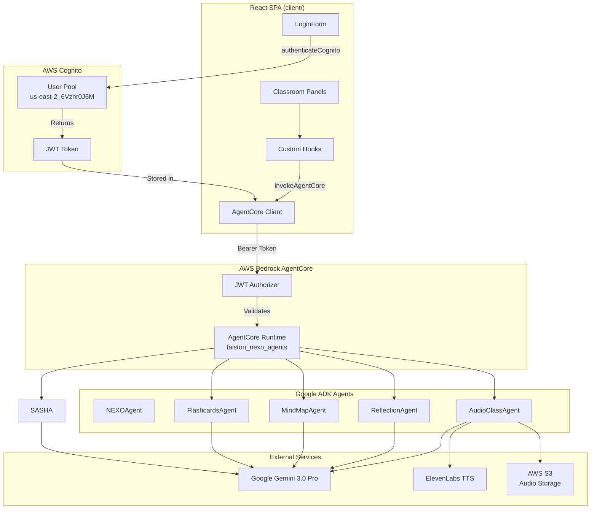
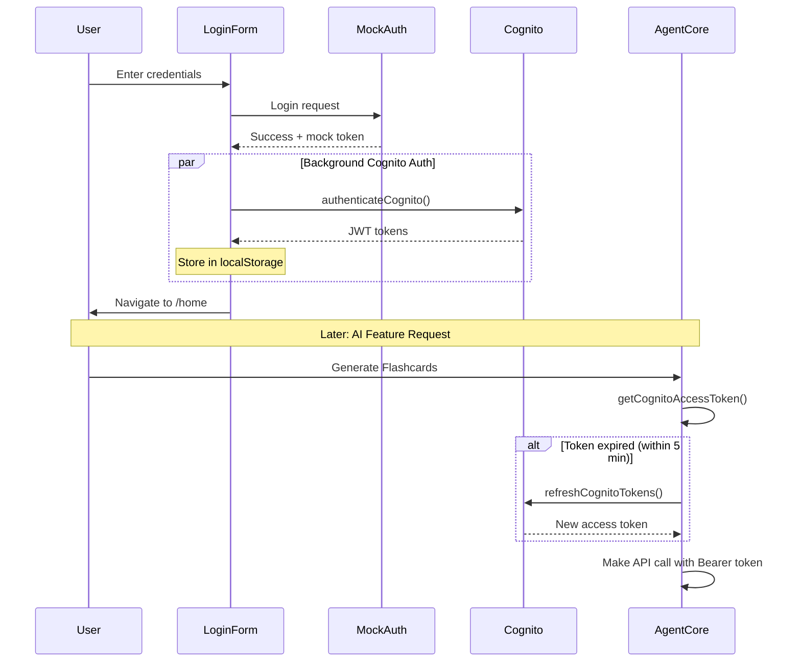

# AgentCore Implementation Guide

Complete guide for implementing AWS Bedrock AgentCore with Google ADK framework in Faiston One Platform.

## Table of Contents

1. [Architecture Overview](#1-architecture-overview)
2. [Authentication Setup](#2-authentication-setup)
3. [AgentCore Client Implementation](#3-agentcore-client-implementation)
4. [Frontend Hooks Pattern](#4-frontend-hooks-pattern)
5. [Backend Agent Architecture](#5-backend-agent-architecture)
6. [Deployment and Infrastructure](#6-deployment-and-infrastructure)
7. [Step-by-Step: Creating a New Agent (QuizAgent Tutorial)](#7-step-by-step-creating-a-new-agent-quizagent-tutorial)
8. [Troubleshooting Guide](#8-troubleshooting-guide)

---

## 1. Architecture Overview

### System Architecture Diagram



### Key Components

| Component | Location | Purpose |
|-----------|----------|---------|
| Cognito Service | `client/services/cognito.ts` | JWT token acquisition for AgentCore auth |
| AgentCore Client | `client/services/agentcore.ts` | Direct AgentCore Runtime invocation |
| Custom Hooks | `client/hooks/use*.ts` | TanStack Query wrappers for AI features |
| Backend Agents | `server/agentcore/agents/` | Google ADK agents with Gemini 3.0 Pro |
| Main Entrypoint | `server/agentcore/main.py` | BedrockAgentCoreApp request routing |

### Architecture Benefits

| Benefit | Description |
|---------|-------------|
| **Lower Latency** | No Lambda cold start - direct AgentCore invocation |
| **No Timeout Limits** | Bypasses API Gateway 30-second timeout |
| **Cost Reduction** | ~70-80% reduction by eliminating Lambda proxy |
| **Built-in Streaming** | Native SSE support for real-time responses |
| **Session Continuity** | AgentCore Memory for conversation persistence |

### Data Flow

```
User Action (e.g., Generate Flashcards)
    |
    v
Classroom Panel Component (FlashcardsPanel.tsx)
    |
    v
Custom Hook (useFlashcards.ts)
    |
    v
AgentCore Client (agentcore.ts)
    |
    +-- Get JWT from Cognito (cognito.ts)
    |
    v
HTTP POST to AgentCore Runtime
    Headers: Authorization: Bearer <jwt>
    Body: { action: "generate_flashcards", ... }
    |
    v
AgentCore Runtime (main.py)
    |
    +-- Route by action field
    |
    v
FlashcardsAgent (flashcards_agent.py)
    |
    +-- Google ADK Agent with Gemini 3.0 Pro
    |
    v
JSON Response
    |
    v
Hook processes and caches result
    |
    v
UI updates with generated content
```

---

## 2. Authentication Setup

### Cognito Configuration

Faiston One Platform uses AWS Cognito for JWT token authentication with AgentCore. The tokens are obtained separately from the app's mock authentication.

**Cognito Details:**

| Setting | Value |
|---------|-------|
| Region | `us-east-2` |
| User Pool ID | `us-east-2_6Vzhr0J6M` |
| Client ID | `dqqebean5q4fq14bkp2bofnsj` |
| Auth Flow | `USER_PASSWORD_AUTH` |

### cognito.ts Implementation

**File:** `/Users/fabio.santos/LPD Repos/lpd-faiston-allinone/client/services/cognito.ts`

```typescript
// =============================================================================
// Cognito Authentication Service (for AgentCore JWT auth only)
// =============================================================================
// Purpose: Authenticate users with AWS Cognito to obtain JWT tokens for
// direct AgentCore Runtime invocation.
//
// Reference: https://docs.aws.amazon.com/bedrock-agentcore/latest/devguide/runtime-oauth.html
//
// Note: This is NOT used for app user authentication (which uses mock auth).
// This is ONLY for obtaining JWT tokens to invoke AgentCore directly.
// =============================================================================

const COGNITO_REGION = import.meta.env.VITE_COGNITO_REGION || 'us-east-2';
const COGNITO_USER_POOL_ID = import.meta.env.VITE_COGNITO_USER_POOL_ID || '';
const COGNITO_CLIENT_ID = import.meta.env.VITE_COGNITO_CLIENT_ID || '';

// Token storage keys
const STORAGE_KEY = 'faiston_cognito_tokens';

export interface CognitoTokens {
  accessToken: string;
  idToken: string;
  refreshToken: string;
  expiresAt: number; // Unix timestamp in milliseconds
}

// In-memory cache for current session
let cachedTokens: CognitoTokens | null = null;

/**
 * Authenticate user with Cognito and obtain JWT tokens.
 * Uses the direct Cognito API (no Amplify SDK required).
 */
export async function authenticateCognito(
  username: string,
  password: string
): Promise<CognitoTokens> {
  const endpoint = `https://cognito-idp.${COGNITO_REGION}.amazonaws.com/`;

  const response = await fetch(endpoint, {
    method: 'POST',
    headers: {
      'Content-Type': 'application/x-amz-json-1.1',
      'X-Amz-Target': 'AWSCognitoIdentityProviderService.InitiateAuth',
    },
    body: JSON.stringify({
      AuthFlow: 'USER_PASSWORD_AUTH',
      ClientId: COGNITO_CLIENT_ID,
      AuthParameters: {
        USERNAME: username,
        PASSWORD: password,
      },
    }),
  });

  if (!response.ok) {
    const error = await response.json().catch(() => ({}));
    const message = error.__type || error.message || 'Authentication failed';
    throw new Error(`Cognito authentication failed: ${message}`);
  }

  const data = await response.json();

  // Check for challenge (e.g., NEW_PASSWORD_REQUIRED)
  if (data.ChallengeName) {
    throw new Error(`Authentication challenge required: ${data.ChallengeName}`);
  }

  const result = data.AuthenticationResult;
  if (!result) {
    throw new Error('No authentication result returned');
  }

  const tokens: CognitoTokens = {
    accessToken: result.AccessToken,
    idToken: result.IdToken,
    refreshToken: result.RefreshToken,
    expiresAt: Date.now() + result.ExpiresIn * 1000,
  };

  // Cache tokens in memory and localStorage
  cachedTokens = tokens;
  try {
    localStorage.setItem(STORAGE_KEY, JSON.stringify(tokens));
  } catch {
    // localStorage not available, tokens will be memory-only
  }

  return tokens;
}

/**
 * Refresh tokens using the refresh token.
 */
export async function refreshCognitoTokens(): Promise<CognitoTokens> {
  const tokens = getCachedTokens();
  if (!tokens?.refreshToken) {
    throw new Error('No refresh token available');
  }

  const endpoint = `https://cognito-idp.${COGNITO_REGION}.amazonaws.com/`;

  const response = await fetch(endpoint, {
    method: 'POST',
    headers: {
      'Content-Type': 'application/x-amz-json-1.1',
      'X-Amz-Target': 'AWSCognitoIdentityProviderService.InitiateAuth',
    },
    body: JSON.stringify({
      AuthFlow: 'REFRESH_TOKEN_AUTH',
      ClientId: COGNITO_CLIENT_ID,
      AuthParameters: {
        REFRESH_TOKEN: tokens.refreshToken,
      },
    }),
  });

  if (!response.ok) {
    // Refresh failed, clear tokens
    clearCognitoTokens();
    throw new Error('Token refresh failed');
  }

  const data = await response.json();
  const result = data.AuthenticationResult;

  const newTokens: CognitoTokens = {
    accessToken: result.AccessToken,
    idToken: result.IdToken,
    refreshToken: tokens.refreshToken, // Refresh token is not rotated
    expiresAt: Date.now() + result.ExpiresIn * 1000,
  };

  // Update cache
  cachedTokens = newTokens;
  try {
    localStorage.setItem(STORAGE_KEY, JSON.stringify(newTokens));
  } catch {
    // localStorage not available
  }

  return newTokens;
}

/**
 * Get the current access token for AgentCore invocation.
 * Returns null if not authenticated or token is expired.
 * Automatically refreshes token if it's about to expire.
 */
export async function getCognitoAccessToken(): Promise<string | null> {
  let tokens = getCachedTokens();

  if (!tokens) {
    return null;
  }

  // Check if token is expired or about to expire (within 5 minutes)
  const fiveMinutes = 5 * 60 * 1000;
  if (Date.now() > tokens.expiresAt - fiveMinutes) {
    try {
      tokens = await refreshCognitoTokens();
    } catch {
      return null;
    }
  }

  return tokens.accessToken;
}

/**
 * Get cached tokens without refreshing.
 */
function getCachedTokens(): CognitoTokens | null {
  // Try memory cache first
  if (cachedTokens) {
    return cachedTokens;
  }

  // Try localStorage
  try {
    const stored = localStorage.getItem(STORAGE_KEY);
    if (stored) {
      cachedTokens = JSON.parse(stored);
      return cachedTokens;
    }
  } catch {
    // localStorage not available or invalid data
  }

  return null;
}

/**
 * Clear all Cognito tokens (logout).
 */
export function clearCognitoTokens(): void {
  cachedTokens = null;
  try {
    localStorage.removeItem(STORAGE_KEY);
  } catch {
    // localStorage not available
  }
}

/**
 * Check if user has valid Cognito tokens.
 */
export function hasCognitoTokens(): boolean {
  const tokens = getCachedTokens();
  return tokens !== null && Date.now() < tokens.expiresAt;
}

/**
 * Get Cognito configuration (for debugging).
 */
export function getCognitoConfig() {
  return {
    region: COGNITO_REGION,
    userPoolId: COGNITO_USER_POOL_ID,
    clientId: COGNITO_CLIENT_ID,
    configured: Boolean(COGNITO_USER_POOL_ID && COGNITO_CLIENT_ID),
  };
}
```

### LoginForm Integration

**File:** `/Users/fabio.santos/LPD Repos/lpd-faiston-allinone/client/components/auth/LoginForm.tsx`

The LoginForm performs dual authentication:
1. **App Authentication**: Mock auth for UI login
2. **Cognito Authentication**: Background JWT acquisition for AgentCore

```typescript
import { authenticateCognito } from "@/services/cognito";

const onSubmit = async (data: LoginFormData) => {
  setApiError(null);
  try {
    const response = await loginMutation.mutateAsync(data as any);

    if (response.success && response.access_token && response.user) {
      // Use auth context to store user and token
      login(response.user, response.access_token);

      // Also authenticate with Cognito for AgentCore JWT tokens
      // This runs in background - don't block UI login if it fails
      // Note: Cognito password policy requires uppercase, so we try both variants
      authenticateCognito(data.email, data.password)
        .catch(() => {
          // Try with capitalized password (Cognito policy: uppercase required)
          const capitalizedPassword =
            data.password.charAt(0).toUpperCase() + data.password.slice(1);
          return authenticateCognito(data.email, capitalizedPassword);
        })
        .catch((err) => {
          // Cognito auth failed - AI features won't work, but UI login succeeded
          console.warn('Cognito authentication failed (AI features may not work):', err.message);
        });

      navigate("/home");
    } else {
      setApiError(response.error?.message || "Login failed");
    }
  } catch (error) {
    const message =
      error instanceof Error ? error.message : "Network error. Try again.";
    setApiError(message);
  }
};
```

### Token Lifecycle



### Environment Variables

Add to `.env` (frontend):

```bash
VITE_COGNITO_REGION=us-east-2
VITE_COGNITO_USER_POOL_ID=us-east-2_6Vzhr0J6M
VITE_COGNITO_CLIENT_ID=dqqebean5q4fq14bkp2bofnsj
```

---

## 3. AgentCore Client Implementation

### agentcore.ts Overview

**File:** `/Users/fabio.santos/LPD Repos/lpd-faiston-allinone/client/services/agentcore.ts`

The AgentCore client handles all direct communication with AWS Bedrock AgentCore Runtime.

### Complete Implementation

```typescript
// =============================================================================
// AgentCore Direct Invocation Service
// =============================================================================
// Purpose: Invoke AWS Bedrock AgentCore Runtime directly from the React SPA
// using JWT Bearer Token authentication.
//
// This is the ONLY method of invoking AgentCore - no Lambda fallback.
// AWS Pattern: https://docs.aws.amazon.com/bedrock-agentcore/latest/devguide/runtime-invoke-agent.html
//
// Benefits:
// - Lower latency (no Lambda cold start)
// - No API Gateway 30s timeout
// - ~70-80% cost reduction
// - Built-in streaming support
// =============================================================================

import { getCognitoAccessToken } from './cognito';

// Configuration from environment variables
const AGENTCORE_ENDPOINT =
  import.meta.env.VITE_AGENTCORE_ENDPOINT ||
  'https://bedrock-agentcore.us-east-2.amazonaws.com';
const AGENTCORE_ARN =
  import.meta.env.VITE_AGENTCORE_ARN ||
  'arn:aws:bedrock-agentcore:us-east-2:377311924364:runtime/faiston_nexo_agents-WNYXe1CyLz';

// Session ID storage for conversation continuity
const SESSION_STORAGE_KEY = 'faiston_agentcore_session';

export interface AgentCoreRequest {
  action: string;
  [key: string]: unknown;
}

export interface AgentCoreResponse<T = unknown> {
  data: T;
  sessionId: string;
}

export interface AgentCoreError {
  code: string;
  message: string;
}

/**
 * Generate a unique session ID for AgentCore conversations.
 * Must be at least 33 characters to meet AgentCore requirements.
 */
function generateSessionId(): string {
  return `session-${crypto.randomUUID().replace(/-/g, '')}`;
}

/**
 * Get or create a session ID for the current user session.
 */
export function getSessionId(): string {
  try {
    let sessionId = sessionStorage.getItem(SESSION_STORAGE_KEY);
    if (!sessionId) {
      sessionId = generateSessionId();
      sessionStorage.setItem(SESSION_STORAGE_KEY, sessionId);
    }
    return sessionId;
  } catch {
    // sessionStorage not available
    return generateSessionId();
  }
}

/**
 * Clear the current session (start fresh conversation).
 */
export function clearSession(): void {
  try {
    sessionStorage.removeItem(SESSION_STORAGE_KEY);
  } catch {
    // sessionStorage not available
  }
}

/**
 * Invoke AgentCore Runtime directly with JWT authentication.
 *
 * @param request - The request payload including action and parameters
 * @param useSession - Whether to maintain session continuity (default: true)
 * @returns The agent response
 */
export interface InvokeOptions {
  useSession?: boolean;
  signal?: AbortSignal;
}

export async function invokeAgentCore<T = unknown>(
  request: AgentCoreRequest,
  options: InvokeOptions | boolean = true
): Promise<AgentCoreResponse<T>> {
  // Handle backward compatibility (old signature: useSession boolean)
  const opts: InvokeOptions = typeof options === 'boolean'
    ? { useSession: options }
    : options;
  const { useSession = true, signal } = opts;

  // Get JWT token
  const token = await getCognitoAccessToken();
  if (!token) {
    throw new Error('Not authenticated with Cognito. Please log in first.');
  }

  // Build URL
  const encodedArn = encodeURIComponent(AGENTCORE_ARN);
  const url = `${AGENTCORE_ENDPOINT}/runtimes/${encodedArn}/invocations?qualifier=DEFAULT`;

  // Get session ID
  const sessionId = useSession ? getSessionId() : generateSessionId();

  // Make request
  const response = await fetch(url, {
    method: 'POST',
    headers: {
      Authorization: `Bearer ${token}`,
      'Content-Type': 'application/json',
      'X-Amzn-Bedrock-AgentCore-Runtime-Session-Id': sessionId,
    },
    body: JSON.stringify(request),
    signal,
  });

  // Handle errors
  if (!response.ok) {
    const errorBody = await response.text();
    let errorMessage = `AgentCore error: ${response.status} ${response.statusText}`;

    try {
      const errorJson = JSON.parse(errorBody);
      errorMessage = errorJson.message || errorJson.Message || errorMessage;
    } catch {
      if (errorBody) {
        errorMessage = errorBody;
      }
    }

    // Handle specific error codes
    if (response.status === 401) {
      throw new Error('AgentCore authentication failed. Token may be expired.');
    }
    if (response.status === 403) {
      throw new Error('AgentCore access denied. Check JWT authorizer configuration.');
    }

    throw new Error(errorMessage);
  }

  // Parse response
  const contentType = response.headers.get('content-type') || '';

  // Handle streaming response (Server-Sent Events)
  if (contentType.includes('text/event-stream')) {
    const data = await parseSSEResponse<T>(response);
    return { data, sessionId };
  }

  // Handle JSON response
  if (contentType.includes('application/json')) {
    const data = (await response.json()) as T;
    return { data, sessionId };
  }

  // Handle plain text response
  const text = await response.text();
  try {
    const data = JSON.parse(text) as T;
    return { data, sessionId };
  } catch {
    return { data: text as unknown as T, sessionId };
  }
}

/**
 * Parse Server-Sent Events (SSE) streaming response.
 */
async function parseSSEResponse<T>(response: Response): Promise<T> {
  const reader = response.body?.getReader();
  if (!reader) {
    throw new Error('No response body for streaming');
  }

  const decoder = new TextDecoder();
  const chunks: string[] = [];

  while (true) {
    const { done, value } = await reader.read();
    if (done) break;

    const chunk = decoder.decode(value, { stream: true });
    const lines = chunk.split('\n');

    for (const line of lines) {
      // SSE format: "data: <json>"
      if (line.startsWith('data: ')) {
        const data = line.slice(6);
        if (data && data !== '[DONE]') {
          chunks.push(data);
        }
      }
    }
  }

  // Join all chunks and parse as JSON
  const fullResponse = chunks.join('');
  try {
    return JSON.parse(fullResponse) as T;
  } catch {
    return fullResponse as unknown as T;
  }
}
```

### Session ID Requirements

**Critical:** AgentCore requires session IDs to be at least 33 characters.

```typescript
// WRONG - Too short, will fail
const sessionId = "12345";

// CORRECT - 41 characters
const sessionId = `session-${crypto.randomUUID().replace(/-/g, '')}`;
// Result: "session-a1b2c3d4e5f6g7h8i9j0k1l2m3n4o5p6"
```

### URL Construction

```
Base URL: https://bedrock-agentcore.us-east-2.amazonaws.com
ARN: arn:aws:bedrock-agentcore:us-east-2:377311924364:runtime/faiston_nexo_agents-WNYXe1CyLz
Encoded ARN: arn%3Aaws%3Abedrock-agentcore%3Aus-east-2%3A377311924364%3Aruntime%2Ffaiston_nexo_agents-WNYXe1CyLz

Full URL: https://bedrock-agentcore.us-east-2.amazonaws.com/runtimes/arn%3Aaws%3Abedrock-agentcore%3Aus-east-2%3A377311924364%3Aruntime%2Ffaiston_nexo_agents-WNYXe1CyLz/invocations?qualifier=DEFAULT
```

### Required Headers

| Header | Value | Purpose |
|--------|-------|---------|
| `Authorization` | `Bearer <jwt>` | Cognito JWT for authentication |
| `Content-Type` | `application/json` | Request body format |
| `X-Amzn-Bedrock-AgentCore-Runtime-Session-Id` | `session-...` | Conversation continuity |

### TypeScript Interfaces

```typescript
// Request/Response types for each action

export interface FlashcardsRequest {
  transcription: string;
  difficulty?: 'easy' | 'medium' | 'hard';
  count?: number;
  custom_prompt?: string;
}

export interface FlashcardsResponse {
  flashcards: Array<{
    id?: string;
    front?: string;
    back?: string;
    question?: string;
    answer?: string;
    tags?: string[];
    difficulty?: 'easy' | 'medium' | 'hard';
  }>;
}

export interface MindMapRequest {
  transcription: string;
  episode_title?: string;
}

export interface MindMapNode {
  id: string;
  label: string;
  description?: string;
  timestamp?: number;
  children?: MindMapNode[];
}

export interface MindMapResponse {
  title: string;
  nodes: MindMapNode[];
  generatedAt: string;
  model?: string;
}

export interface SashaChatRequest {
  question: string;
  transcription: string;
  episode_title?: string;
  conversation_history?: Array<{ role: string; content: string }>;
}

export interface SashaChatResponse {
  answer: string;
}

export interface ReflectionRequest {
  transcription: string;
  reflection: string;
}

export interface ReflectionResponse {
  overall_score: number;
  coerencia: number;
  completude: number;
  precisao: number;
  pontos_fortes: string[];
  pontos_atencao: string[];
  proximos_passos: Array<{ text: string; timestamp: number | null }>;
  xp_earned: number;
  model: string;
}

export interface AudioClassRequest {
  transcription: string;
  mode?: 'deep_explanation' | 'debate' | 'summary';
  student_name?: string;
  custom_prompt?: string;
  episode_id?: string;
}

export interface AudioClassResponse {
  audio_base64?: string;
  audio_url?: string;
  duration_seconds: number;
  mode: string;
  student_name: string;
}
```

### Action Helper Functions

```typescript
/**
 * Generate flashcards from transcription.
 */
export async function generateFlashcards(
  params: FlashcardsRequest
): Promise<AgentCoreResponse<FlashcardsResponse>> {
  return invokeAgentCore<FlashcardsResponse>({
    action: 'generate_flashcards',
    transcription: params.transcription,
    difficulty: params.difficulty || 'medium',
    num_cards: params.count || 10,
    custom_prompt: params.custom_prompt || '',
  });
}

/**
 * Generate mind map from transcription.
 */
export async function generateMindMap(
  params: MindMapRequest
): Promise<AgentCoreResponse<MindMapResponse>> {
  return invokeAgentCore<MindMapResponse>({
    action: 'generate_mindmap',
    transcription: params.transcription,
    episode_title: params.episode_title || 'Aula',
  });
}

/**
 * Chat with Sasha AI tutor.
 */
export async function sashaChat(
  params: SashaChatRequest
): Promise<AgentCoreResponse<SashaChatResponse>> {
  return invokeAgentCore<SashaChatResponse>({
    action: 'nexo_chat',
    question: params.question,
    transcription: params.transcription,
    episode_title: params.episode_title || '',
    conversation_history: params.conversation_history || [],
  });
}

/**
 * Analyze student reflection.
 */
export async function analyzeReflection(
  params: ReflectionRequest
): Promise<AgentCoreResponse<ReflectionResponse>> {
  return invokeAgentCore<ReflectionResponse>({
    action: 'analyze_reflection',
    student_explanation: params.reflection,
    transcription: params.transcription,
    episode_title: '',
  });
}

/**
 * Generate audio class.
 */
export async function generateAudioClass(
  params: AudioClassRequest,
  signal?: AbortSignal
): Promise<AgentCoreResponse<AudioClassResponse>> {
  return invokeAgentCore<AudioClassResponse>(
    {
      action: 'generate_audio_class',
      transcription: params.transcription,
      mode: params.mode || 'deep_explanation',
      student_name: params.student_name || 'Estudante',
      custom_prompt: params.custom_prompt || undefined,
    },
    { signal }
  );
}
```

---

## 4. Frontend Hooks Pattern

### TanStack Query Integration

All AI features use TanStack Query's `useMutation` for:
- Loading state management
- Error handling
- Optimistic updates
- Cache invalidation

### useMindMap Hook Example

**File:** `/Users/fabio.santos/LPD Repos/lpd-faiston-allinone/client/hooks/useMindMap.ts`

```typescript
import { useState, useEffect, useCallback } from "react";
import { useMutation } from "@tanstack/react-query";
import { generateMindMap, MindMapResponse } from "@/services/agentcore";

// Hierarchical mind map node from AI
export interface MindMapNode {
  id: string;
  label: string;
  description?: string;
  timestamp?: number; // Video timestamp in seconds (for leaf nodes)
  children?: MindMapNode[];
}

// Mind map data structure from API
export interface MindMapData {
  title: string;
  nodes: MindMapNode[];
  generatedAt: string;
  model?: string;
}


// Storage key generator
const getStorageKey = (courseId: string, episodeId: string) =>
  `faiston_mindmap_${courseId}_${episodeId}`;

// Collect all node IDs from hierarchical structure
function collectAllNodeIds(nodes: MindMapNode[]): string[] {
  const ids: string[] = [];

  function traverse(node: MindMapNode) {
    ids.push(node.id);
    if (node.children) {
      node.children.forEach(traverse);
    }
  }

  nodes.forEach(traverse);
  return ids;
}

export function useMindMap(
  courseId: string,
  episodeId: string,
  episodeTitle: string,
  onSeek?: (time: number) => void
) {
  // Mind map data state
  const [mindMapData, setMindMapData] = useState<MindMapData | null>(null);
  const [expandedNodes, setExpandedNodes] = useState<Set<string>>(new Set());

  // Load from localStorage on mount
  useEffect(() => {
    const storageKey = getStorageKey(courseId, episodeId);
    const stored = localStorage.getItem(storageKey);
    if (stored) {
      try {
        const parsed = JSON.parse(stored);
        if (parsed.data) {
          setMindMapData(parsed.data);
        }
        if (parsed.expanded && Array.isArray(parsed.expanded)) {
          setExpandedNodes(new Set(parsed.expanded));
        }
      } catch (e) {
        console.error("Failed to parse stored mindmap:", e);
      }
    }
  }, [courseId, episodeId]);

  // Save to localStorage when data changes
  useEffect(() => {
    if (mindMapData) {
      const storageKey = getStorageKey(courseId, episodeId);
      const data = {
        data: mindMapData,
        expanded: Array.from(expandedNodes),
      };
      localStorage.setItem(storageKey, JSON.stringify(data));
    }
  }, [mindMapData, expandedNodes, courseId, episodeId]);

  // Toggle node expansion
  const toggleNode = useCallback((nodeId: string) => {
    setExpandedNodes((prev) => {
      const next = new Set(prev);
      if (next.has(nodeId)) {
        next.delete(nodeId);
      } else {
        next.add(nodeId);
      }
      return next;
    });
  }, []);

  // Generate mutation - uses direct AgentCore invocation
  const generateMutation = useMutation({
    mutationFn: async (transcription: string): Promise<MindMapData> => {
      const { data } = await generateMindMap({
        transcription,
        episode_title: episodeTitle,
      });
      // Cast nodes to local type (compatible structure)
      return {
        title: data.title,
        nodes: data.nodes as MindMapNode[],
        generatedAt: data.generatedAt,
        model: data.model,
      };
    },
    onSuccess: (data) => {
      setMindMapData(data);
      // Start with only root expanded (user explores progressively)
      // NotebookLM-style: collapsed by default, user clicks to expand
      setExpandedNodes(new Set(["root"]));
    },
  });

  // Expand all nodes
  const expandAll = useCallback(() => {
    if (!mindMapData) return;
    const allIds = collectAllNodeIds(mindMapData.nodes);
    setExpandedNodes(new Set(["root", ...allIds]));
  }, [mindMapData]);

  // Collapse all nodes (only root visible)
  const collapseAll = useCallback(() => {
    setExpandedNodes(new Set(["root"]));
  }, []);

  // Reset mind map
  const resetMindMap = useCallback(() => {
    setMindMapData(null);
    setExpandedNodes(new Set());
    const storageKey = getStorageKey(courseId, episodeId);
    localStorage.removeItem(storageKey);
  }, [courseId, episodeId]);

  return {
    // Data
    mindMapData,
    expandedNodes,

    // Actions
    generate: generateMutation.mutate,
    toggleNode,
    expandAll,
    collapseAll,
    resetMindMap,

    // Mutation state
    isGenerating: generateMutation.isPending,
    generateError: generateMutation.error,

    // Helpers
    hasMindMap: mindMapData !== null,
  };
}
```

### Hook Pattern Summary

```typescript
// Standard pattern for AI feature hooks

export function useAIFeature(params: Params) {
  // 1. Local state for data
  const [data, setData] = useState<DataType | null>(null);

  // 2. Load from localStorage on mount
  useEffect(() => {
    const stored = localStorage.getItem(getStorageKey(params));
    if (stored) {
      setData(JSON.parse(stored));
    }
  }, [params]);

  // 3. Save to localStorage on change
  useEffect(() => {
    if (data) {
      localStorage.setItem(getStorageKey(params), JSON.stringify(data));
    }
  }, [data, params]);

  // 4. TanStack Query mutation for generation
  const mutation = useMutation({
    mutationFn: async (input: InputType) => {
      const { data } = await agentCoreAction(input);
      return data;
    },
    onSuccess: (result) => {
      setData(result);
    },
  });

  // 5. Reset function
  const reset = useCallback(() => {
    setData(null);
    localStorage.removeItem(getStorageKey(params));
  }, [params]);

  return {
    data,
    generate: mutation.mutate,
    isGenerating: mutation.isPending,
    error: mutation.error,
    reset,
    hasData: data !== null,
  };
}
```

### Error Handling

```typescript
const mutation = useMutation({
  mutationFn: async (input) => {
    try {
      const { data } = await agentCoreAction(input);
      return data;
    } catch (error) {
      // Handle specific AgentCore errors
      if (error instanceof Error) {
        if (error.message.includes('Not authenticated')) {
          // Redirect to login or show auth modal
          throw new Error('Sessao expirada. Faca login novamente.');
        }
        if (error.message.includes('access denied')) {
          throw new Error('Sem permissao para esta acao.');
        }
      }
      throw error;
    }
  },
  onError: (error) => {
    console.error('AI feature error:', error);
    // Show toast notification
    toast.error(error.message);
  },
});
```

---

## 5. Backend Agent Architecture

### Google ADK Framework

All agents use the Google Agent Development Kit (ADK) with native Gemini 3.0 Pro.

**Key Components:**

| Class | Purpose |
|-------|---------|
| `Agent` | Defines agent behavior with model, name, instruction |
| `Runner` | Executes agent with session context |
| `InMemorySessionService` | Manages conversation sessions |
| `types.Content` | Represents user/assistant messages |

### Directory Structure

```
server/agentcore/
├── main.py                    # BedrockAgentCoreApp entrypoint
├── agents/
│   ├── __init__.py           # Agent exports
│   ├── utils.py              # Shared utilities
│   ├── nexo_agent.py        # AI tutor
│   ├── flashcards_agent.py   # Flashcard generator
│   ├── mindmap_agent.py      # Mind map generator
│   ├── reflection_agent.py   # Reflection analyzer
│   └── audioclass_agent.py   # Audio class generator
└── tools/
    └── elevenlabs_tool.py    # TTS integration
```

### Main Entrypoint

**File:** `/Users/fabio.santos/LPD Repos/lpd-faiston-allinone/server/agentcore/main.py`

```python
# =============================================================================
# AWS Bedrock AgentCore Runtime Entrypoint
# =============================================================================
# Main entrypoint for Faiston One Platform agents deployed to AgentCore Runtime.
# Uses BedrockAgentCoreApp decorator pattern for serverless deployment.
#
# Framework: Google ADK with native Gemini 3.0 Pro (no LiteLLM wrapper)
# Model: All agents use gemini-3-pro-preview exclusively
# Memory: AgentCore Memory (faiston_nexo_agents_mem-2LaTp8COvj)
#
# Migration Note (December 2025):
# All agents migrated from Claude Sonnet 4.5 (LiteLLM) to Gemini native.
#
# Based on:
# - https://github.com/awslabs/amazon-bedrock-agentcore-samples/tree/main/03-integrations/agentic-frameworks/adk
# - https://docs.aws.amazon.com/bedrock-agentcore/latest/devguide/using-any-agent-framework.html
# =============================================================================

# Note: GOOGLE_API_KEY is passed via --env at deploy time (not runtime SSM lookup)
# This follows the AWS official example pattern.

from bedrock_agentcore.runtime import BedrockAgentCoreApp
import asyncio
import json
import os

# Import all agents (these import Google packages internally)
from agents.nexo_agent import NEXOAgent
from agents.flashcards_agent import FlashcardsAgent
from agents.mindmap_agent import MindMapAgent
from agents.reflection_agent import ReflectionAgent
from agents.audioclass_agent import AudioClassAgent

# =============================================================================
# AgentCore Application
# =============================================================================

app = BedrockAgentCoreApp()


@app.entrypoint
def invoke(payload: dict, context) -> dict:
    """
    Main entrypoint for AgentCore Runtime.

    Routes requests to the appropriate agent based on the 'action' field.

    Args:
        payload: Request payload containing action and parameters
        context: AgentCore context with session_id, etc.

    Returns:
        Agent response as dict
    """
    action = payload.get("action", "nexo_chat")
    user_id = payload.get("user_id", "anonymous")
    session_id = getattr(context, "session_id", "default-session")

    # Route to appropriate agent
    try:
        if action == "nexo_chat":
            return asyncio.run(_nexo_chat(payload, user_id, session_id))

        elif action == "generate_flashcards":
            return asyncio.run(_generate_flashcards(payload))

        elif action == "generate_mindmap":
            return asyncio.run(_generate_mindmap(payload))

        elif action == "analyze_reflection":
            return asyncio.run(_analyze_reflection(payload))

        elif action == "generate_audio_class":
            return asyncio.run(_generate_audio_class(payload))

        else:
            return {"error": f"Unknown action: {action}"}

    except Exception as e:
        return {"error": str(e), "action": action}


# =============================================================================
# Agent Handlers
# =============================================================================


async def _nexo_chat(payload: dict, user_id: str, session_id: str) -> dict:
    """
    Handle Sasha AI tutor chat requests.

    Sasha is a RAG-based tutoring agent that answers questions
    based on episode transcription content.
    """
    agent = NEXOAgent()

    question = payload.get("question", "")
    transcription = payload.get("transcription", "")
    history = payload.get("history", [])

    # Format history for context
    history_text = ""
    for msg in history[-10:]:  # Last 10 messages for context
        role = msg.get("role", "user")
        content = msg.get("content", "")
        history_text += f"{role.upper()}: {content}\n"

    # Build prompt with transcription context
    prompt = f"""
Transcricao da aula (use APENAS este conteudo para responder):
{transcription}

Historico da conversa:
{history_text}

Pergunta do aluno:
{question}

Responda de forma acolhedora, didatica e acessivel. NUNCA revele que suas respostas vem da transcricao.
"""

    # Invoke agent
    response = await agent.invoke(prompt, user_id, session_id)

    # Save to AgentCore Memory
    agent.save_to_memory(session_id, user_id, {"role": "user", "content": question})
    agent.save_to_memory(session_id, user_id, {"role": "assistant", "content": response})

    return {"answer": response}


async def _generate_flashcards(payload: dict) -> dict:
    """
    Handle flashcard generation requests.

    Generates study flashcards from transcription content
    following Anki/SuperMemo best practices.
    """
    agent = FlashcardsAgent()

    return await agent.generate(
        transcription=payload.get("transcription", ""),
        difficulty=payload.get("difficulty", "medium"),
        count=payload.get("count", 10),
        custom_prompt=payload.get("custom_prompt", ""),
    )


async def _generate_mindmap(payload: dict) -> dict:
    """
    Handle mind map generation requests.

    Generates hierarchical mind map with timestamps
    for video navigation.
    """
    agent = MindMapAgent()

    return await agent.generate(
        transcription=payload.get("transcription", ""),
        episode_title=payload.get("episode_title", "Aula"),
    )


async def _analyze_reflection(payload: dict) -> dict:
    """
    Handle reflection analysis requests.

    Analyzes student reflections and provides
    feedback with video timestamps for review.
    """
    agent = ReflectionAgent()

    return await agent.analyze(
        transcription=payload.get("transcription", ""),
        reflection=payload.get("reflection", ""),
    )


async def _generate_audio_class(payload: dict) -> dict:
    """
    Handle audio class generation requests.

    Generates podcast-style audio lessons with
    ElevenLabs TTS (Ana & Carlos hosts).
    """
    agent = AudioClassAgent()

    return await agent.generate(
        transcription=payload.get("transcription", ""),
        mode=payload.get("mode", "deep_explanation"),
        student_name=payload.get("student_name", "Aluno"),
        custom_prompt=payload.get("custom_prompt", ""),
        episode_id=payload.get("episode_id", "unknown"),
    )


# =============================================================================
# Run Application
# =============================================================================

if __name__ == "__main__":
    app.run()
```

### Agent Base Pattern

**File:** `/Users/fabio.santos/LPD Repos/lpd-faiston-allinone/server/agentcore/agents/nexo_agent.py`

```python
# =============================================================================
# NEXO AI Tutor Agent - Gemini 3.0 Pro Native
# =============================================================================
# RAG-based tutoring agent that answers student questions
# based on episode transcription content.
#
# Framework: Google ADK with native Gemini 3.0 Pro (no LiteLLM wrapper)
# Memory: AgentCore Memory for conversation persistence (optional)
#
# Migration Note: Migrated from Claude Sonnet 4.5 (LiteLLM) to Gemini native.
# All agents use Gemini 3.0 Pro exclusively.
# =============================================================================

from google.adk.agents import Agent
from google.adk.runners import Runner
from google.adk.sessions import InMemorySessionService
from google.genai import types
from .utils import APP_NAME, MODEL_GEMINI

# =============================================================================
# System Instruction
# =============================================================================

SASHA_INSTRUCTION = """
Voce e Sasha, uma tutora de IA especialista em educacao corporativa e compliance.

## Personalidade
- Acolhedora e amigavel
- Didatica e paciente
- Usa linguagem acessivel e clara
- Encoraja o aprendizado

## Regras OBRIGATORIAS
1. Responda APENAS com base na transcricao fornecida
2. NUNCA revele que suas respostas vem da transcricao
3. Se a pergunta nao puder ser respondida com a transcricao, diga que precisa de mais contexto
4. Use exemplos praticos quando possivel
5. Mantenha respostas concisas mas completas

## Formato de Resposta
- Use markdown para formatacao
- Use listas quando apropriado
- Destaque termos importantes em **negrito**
- Mantenha paragrafos curtos

## Tom
- Profissional mas acessivel
- Encorajador e positivo
- Nunca condescendente
"""


class NEXOAgent:
    """
    NEXO AI Tutor - RAG-based tutoring for Faiston One Platform.

    Answers student questions based on episode transcription content
    with a friendly, educational tone.

    Uses Gemini 3.0 Pro for high quality responses.
    """

    def __init__(self):
        """Initialize Sasha with Gemini 3.0 Pro native."""
        self.agent = Agent(
            model=MODEL_GEMINI,
            name="nexo_agent",
            description="AI tutoring agent that answers questions based on lesson content.",
            instruction=SASHA_INSTRUCTION,
        )
        self.session_service = InMemorySessionService()
        print(f"NEXOAgent initialized with model: {MODEL_GEMINI}")

    async def _setup_session_and_runner(self, user_id: str, session_id: str):
        """Set up session and runner for agent execution."""
        session = await self.session_service.create_session(
            app_name=APP_NAME,
            user_id=user_id,
            session_id=session_id,
        )
        runner = Runner(
            agent=self.agent,
            app_name=APP_NAME,
            session_service=self.session_service,
        )
        return session, runner

    async def invoke(self, prompt: str, user_id: str, session_id: str) -> str:
        """
        Invoke the agent with a prompt and return the response.

        Args:
            prompt: User prompt/question
            user_id: Unique user identifier
            session_id: Unique session identifier

        Returns:
            Agent response as string
        """
        content = types.Content(
            role="user",
            parts=[types.Part(text=prompt)],
        )

        session, runner = await self._setup_session_and_runner(user_id, session_id)

        events = runner.run_async(
            user_id=user_id,
            session_id=session_id,
            new_message=content,
        )

        async for event in events:
            if event.is_final_response():
                if event.content and event.content.parts:
                    return event.content.parts[0].text

        return ""

    def save_to_memory(
        self,
        session_id: str,
        actor_id: str,
        content: dict,
    ) -> None:
        """
        Save an interaction to AgentCore Memory (STM).

        Note: This is a placeholder for AgentCore Memory integration.
        In the native Gemini implementation, we rely on InMemorySessionService
        for conversation context within a session.

        Args:
            session_id: Unique session identifier
            actor_id: Actor/user identifier
            content: Content to save (dict with role and content)
        """
        # AgentCore Memory integration is optional
        # The InMemorySessionService already maintains conversation context
        # This method is kept for API compatibility with main.py
        pass
```

### Shared Utilities

**File:** `/Users/fabio.santos/LPD Repos/lpd-faiston-allinone/server/agentcore/agents/utils.py`

```python
# =============================================================================
# Shared Utilities for Faiston One Platform Agents
# =============================================================================
# Common helpers used across all Gemini-native agents.
#
# Migration Note (December 2025):
# All agents migrated from Claude Sonnet 4.5 (LiteLLM) to Gemini native.
# MindMapAgent was the reference implementation for this migration.
#
# API Key Note:
# GOOGLE_API_KEY is passed via --env at deploy time (not runtime SSM lookup).
# This follows the AWS official example pattern.
# =============================================================================

import json
import re
from typing import Dict, Any

# =============================================================================
# Constants
# =============================================================================

APP_NAME = "faiston-nexo"

# Model ID - All agents use Gemini 3.0 Pro
MODEL_GEMINI = "gemini-3-pro-preview"


# =============================================================================
# JSON Parsing Utilities
# =============================================================================


def extract_json(response: str) -> str:
    """
    Extract JSON from a response that may contain markdown code blocks.

    Args:
        response: Raw response text from LLM

    Returns:
        Extracted JSON string
    """
    # Try to find JSON in markdown code block
    json_match = re.search(r"```(?:json)?\s*([\s\S]*?)\s*```", response)
    if json_match:
        return json_match.group(1).strip()

    # Try to find raw JSON object or array
    json_match = re.search(r"(\{[\s\S]*\}|\[[\s\S]*\])", response)
    if json_match:
        return json_match.group(1).strip()

    # Return as-is if no JSON found
    return response.strip()


def parse_json_safe(response: str) -> Dict[str, Any]:
    """
    Safely parse JSON from response with fallback.

    Args:
        response: Raw response text from LLM

    Returns:
        Parsed JSON dict or error dict
    """
    try:
        json_str = extract_json(response)
        return json.loads(json_str)
    except json.JSONDecodeError as e:
        return {"error": f"Failed to parse JSON: {e}", "raw_response": response}
```

### Agent Configuration Summary

| Agent | Model | Temperature | Purpose |
|-------|-------|-------------|---------|
| NEXOAgent | gemini-3-pro-preview | 0.7 | AI tutor RAG chat |
| FlashcardsAgent | gemini-3-pro-preview | 0.7 | Study card generation |
| MindMapAgent | gemini-3-pro-preview | 0.7 | Concept visualization |
| ReflectionAgent | gemini-3-pro-preview | 0.7 | Learning reflection |
| AudioClassAgent | gemini-3-pro-preview | 0.8 | Podcast script generation |

---

## 6. Deployment and Infrastructure

### GitHub Actions Workflow

**File:** `/Users/fabio.santos/LPD Repos/lpd-faiston-allinone/.github/workflows/deploy-agentcore.yml`

```yaml
# =============================================================================
# AgentCore Deployment Workflow
# =============================================================================
# Deploys Python agents to AWS Bedrock AgentCore Runtime
# Uses Google ADK with native Gemini models (no LiteLLM wrapper)
#
# Framework: Google ADK (Agent Development Kit)
# Model: All agents use gemini-3-pro-preview exclusively
# Auth: AWS Cognito JWT Bearer Token (for React SPA direct invocation)
#
# Migration Note (December 2025):
# - All agents migrated from Claude Sonnet 4.5 (LiteLLM) to Gemini native.
# - Added JWT auth to enable direct AgentCore invocation from frontend
# =============================================================================

name: Deploy AgentCore

on:
  push:
    branches:
      - main
    paths:
      - 'server/agentcore/**'
      - '.github/workflows/deploy-agentcore.yml'
  workflow_dispatch:
    inputs:
      action:
        description: 'Deployment action'
        required: true
        default: 'deploy'
        type: choice
        options:
          - deploy
          - undeploy
          - status

env:
  AWS_REGION: us-east-2
  PYTHON_VERSION: '3.11'
  AGENT_NAME: faiston_nexo_agents

jobs:
  deploy:
    name: Deploy to AgentCore Runtime
    runs-on: ubuntu-latest
    if: ${{ github.event.inputs.action != 'undeploy' }}

    steps:
      - name: Checkout code
        uses: actions/checkout@v4

      - name: Setup Python
        uses: actions/setup-python@v5
        with:
          python-version: ${{ env.PYTHON_VERSION }}

      - name: Configure AWS credentials
        uses: aws-actions/configure-aws-credentials@v4
        with:
          aws-access-key-id: ${{ secrets.AWS_ACCESS_KEY_ID }}
          aws-secret-access-key: ${{ secrets.AWS_SECRET_ACCESS_KEY }}
          aws-region: ${{ env.AWS_REGION }}

      - name: Install uv and AgentCore CLI
        run: |
          # Install uv (required for direct_code_deploy)
          curl -LsSf https://astral.sh/uv/install.sh | sh
          source $HOME/.local/bin/env 2>/dev/null || export PATH="$HOME/.local/bin:$PATH"
          uv --version
          # Install agentcore CLI
          pip install bedrock-agentcore-starter-toolkit --quiet
          agentcore --version || echo "AgentCore CLI installed"

      - name: Update AgentCore config for CI/CD
        working-directory: server/agentcore
        run: |
          # Update paths in config to use CI/CD workspace
          cat > .bedrock_agentcore.yaml << 'EOF'
          default_agent: faiston_nexo_agents
          agents:
            faiston_nexo_agents:
              name: faiston_nexo_agents
              entrypoint: main.py
              deployment_type: direct_code_deploy
              runtime_type: PYTHON_3_11
              platform: linux/arm64
              source_path: .
              aws:
                execution_role: arn:aws:iam::377311924364:role/AmazonBedrockAgentCoreSDKRuntime-us-east-2-87588e0d61
                account: '377311924364'
                region: us-east-2
                s3_path: s3://bedrock-agentcore-codebuild-sources-377311924364-us-east-2
                network_configuration:
                  network_mode: PUBLIC
                protocol_configuration:
                  server_protocol: HTTP
                observability:
                  enabled: true
              bedrock_agentcore:
                agent_id: faiston_nexo_agents-WNYXe1CyLz
                agent_arn: arn:aws:bedrock-agentcore:us-east-2:377311924364:runtime/faiston_nexo_agents-WNYXe1CyLz
              memory:
                mode: STM_ONLY
                memory_id: faiston_nexo_agents_mem-2LaTp8COvj
                memory_arn: arn:aws:bedrock-agentcore:us-east-2:377311924364:memory/faiston_nexo_agents_mem-2LaTp8COvj
              authorizerConfiguration:
                customJWTAuthorizer:
                  discoveryUrl: https://cognito-idp.us-east-2.amazonaws.com/us-east-2_6Vzhr0J6M/.well-known/openid-configuration
                  allowedClients:
                    - dqqebean5q4fq14bkp2bofnsj
                  allowedAudiences:
                    - dqqebean5q4fq14bkp2bofnsj
          EOF

      - name: Deploy to AgentCore Runtime
        working-directory: server/agentcore
        run: |
          export PATH="$HOME/.local/bin:$PATH"
          echo "y" | agentcore deploy --agent ${{ env.AGENT_NAME }} \
            --auto-update-on-conflict \
            --env GOOGLE_API_KEY=${{ secrets.GOOGLE_API_KEY }}

      - name: Configure JWT Authorizer via API
        env:
          GOOGLE_API_KEY: ${{ secrets.GOOGLE_API_KEY }}
        run: |
          # The agentcore CLI doesn't apply authorizerConfiguration from YAML
          # We must call UpdateAgentRuntime API directly to enable JWT auth
          pip install requests boto3 --quiet

          python3 << 'PYTHON_SCRIPT'
          import json
          import boto3
          from botocore.config import Config
          from botocore.auth import SigV4Auth
          from botocore.awsrequest import AWSRequest
          import requests
          import os

          REGION = "us-east-2"
          AGENT_RUNTIME_ID = "faiston_nexo_agents-WNYXe1CyLz"
          COGNITO_POOL_ID = "us-east-2_6Vzhr0J6M"
          COGNITO_CLIENT_ID = "dqqebean5q4fq14bkp2bofnsj"

          session = boto3.Session(region_name=REGION)
          credentials = session.get_credentials()

          # Get current runtime config
          get_url = f"https://bedrock-agentcore-control.{REGION}.amazonaws.com/runtimes/{AGENT_RUNTIME_ID}/"
          get_request = AWSRequest(method="GET", url=get_url)
          SigV4Auth(credentials, "bedrock-agentcore", REGION).add_auth(get_request)

          get_response = requests.get(get_url, headers=dict(get_request.headers))
          current_config = get_response.json()

          # Build update with JWT authorizer
          update_url = f"https://bedrock-agentcore-control.{REGION}.amazonaws.com/runtimes/{AGENT_RUNTIME_ID}/"

          update_body = {
              "agentRuntimeArtifact": current_config.get("agentRuntimeArtifact"),
              "networkConfiguration": current_config.get("networkConfiguration"),
              "roleArn": current_config.get("roleArn"),
              "authorizerConfiguration": {
                  "customJWTAuthorizer": {
                      "discoveryUrl": f"https://cognito-idp.{REGION}.amazonaws.com/{COGNITO_POOL_ID}/.well-known/openid-configuration",
                      "allowedClients": [COGNITO_CLIENT_ID],
                      "allowedAudiences": [COGNITO_CLIENT_ID]
                  }
              },
              "environmentVariables": {
                  "GOOGLE_API_KEY": os.environ.get("GOOGLE_API_KEY", ""),
                  "BEDROCK_AGENTCORE_MEMORY_ID": current_config.get("environmentVariables", {}).get("BEDROCK_AGENTCORE_MEMORY_ID", ""),
                  "BEDROCK_AGENTCORE_MEMORY_NAME": current_config.get("environmentVariables", {}).get("BEDROCK_AGENTCORE_MEMORY_NAME", "")
              }
          }

          if current_config.get("protocolConfiguration"):
              update_body["protocolConfiguration"] = current_config["protocolConfiguration"]

          update_request = AWSRequest(
              method="PUT",
              url=update_url,
              data=json.dumps(update_body),
              headers={"Content-Type": "application/json"}
          )
          SigV4Auth(credentials, "bedrock-agentcore", REGION).add_auth(update_request)

          update_response = requests.put(
              update_url,
              headers=dict(update_request.headers),
              data=json.dumps(update_body)
          )

          if update_response.status_code in [200, 202]:
              print("JWT Authorizer configured successfully!")
          else:
              print(f"Failed to update: {update_response.text}")
          PYTHON_SCRIPT

      - name: Deployment Summary
        run: |
          echo "## AgentCore Deployment Complete!" >> $GITHUB_STEP_SUMMARY
          echo "" >> $GITHUB_STEP_SUMMARY
          echo "| Detail | Value |" >> $GITHUB_STEP_SUMMARY
          echo "|--------|-------|" >> $GITHUB_STEP_SUMMARY
          echo "| Agent Name | \`${{ env.AGENT_NAME }}\` |" >> $GITHUB_STEP_SUMMARY
          echo "| Framework | Google ADK (native Gemini) |" >> $GITHUB_STEP_SUMMARY
          echo "| Model | gemini-3-pro-preview |" >> $GITHUB_STEP_SUMMARY
          echo "| Region | \`${{ env.AWS_REGION }}\` |" >> $GITHUB_STEP_SUMMARY
          echo "| **Auth** | **Cognito JWT Bearer Token** |" >> $GITHUB_STEP_SUMMARY
```

### .bedrock_agentcore.yaml Configuration

```yaml
default_agent: faiston_nexo_agents
agents:
  faiston_nexo_agents:
    name: faiston_nexo_agents
    entrypoint: main.py
    deployment_type: direct_code_deploy
    runtime_type: PYTHON_3_11
    platform: linux/arm64
    source_path: .
    aws:
      execution_role: arn:aws:iam::377311924364:role/AmazonBedrockAgentCoreSDKRuntime-us-east-2-87588e0d61
      account: '377311924364'
      region: us-east-2
      s3_path: s3://bedrock-agentcore-codebuild-sources-377311924364-us-east-2
      network_configuration:
        network_mode: PUBLIC
      protocol_configuration:
        server_protocol: HTTP
      observability:
        enabled: true
    bedrock_agentcore:
      agent_id: faiston_nexo_agents-WNYXe1CyLz
      agent_arn: arn:aws:bedrock-agentcore:us-east-2:377311924364:runtime/faiston_nexo_agents-WNYXe1CyLz
    memory:
      mode: STM_ONLY
      memory_id: faiston_nexo_agents_mem-2LaTp8COvj
      memory_arn: arn:aws:bedrock-agentcore:us-east-2:377311924364:memory/faiston_nexo_agents_mem-2LaTp8COvj
    authorizerConfiguration:
      customJWTAuthorizer:
        discoveryUrl: https://cognito-idp.us-east-2.amazonaws.com/us-east-2_6Vzhr0J6M/.well-known/openid-configuration
        allowedClients:
          - dqqebean5q4fq14bkp2bofnsj
        allowedAudiences:
          - dqqebean5q4fq14bkp2bofnsj
```

### Environment Variables

**GitHub Secrets Required:**

| Secret | Purpose |
|--------|---------|
| `AWS_ACCESS_KEY_ID` | AWS deployment credentials |
| `AWS_SECRET_ACCESS_KEY` | AWS deployment credentials |
| `GOOGLE_API_KEY` | Gemini API access |

---

## 7. Step-by-Step: Creating a New Agent (QuizAgent Tutorial)

This tutorial demonstrates creating a new QuizAgent from scratch.

### Step 1: Define Requirements

**QuizAgent Purpose:** Generate interactive quizzes from video transcription content.

**Features:**
- Multiple choice questions (4 options each)
- Configurable difficulty and question count
- Immediate feedback with explanations
- Score tracking

### Step 2: Create Backend Agent

**File:** `/Users/fabio.santos/LPD Repos/lpd-faiston-allinone/server/agentcore/agents/quiz_agent.py`

```python
# =============================================================================
# Quiz Generator Agent - Gemini 3.0 Pro Native
# =============================================================================
# Generates interactive multiple-choice quizzes from transcription content.
#
# Framework: Google ADK with native Gemini 3.0 Pro (no LiteLLM wrapper)
# Output: JSON with questions, options, correct answer, and explanations
# =============================================================================

from google.adk.agents import Agent
from google.adk.runners import Runner
from google.adk.sessions import InMemorySessionService
from google.genai import types
from .utils import APP_NAME, MODEL_GEMINI, parse_json_safe
from typing import Dict, Any, List

# =============================================================================
# System Instruction
# =============================================================================

QUIZ_INSTRUCTION = """
Voce e um especialista em criacao de avaliacoes educacionais.

## Principios de Design
1. **Clareza**: Perguntas objetivas sem ambiguidade
2. **Relevancia**: Baseado no conteudo da transcricao
3. **Distratores**: Opcoes incorretas devem ser plausíveis
4. **Feedback**: Explicacoes claras para cada resposta

## Niveis de Dificuldade
- **Facil**: Fatos basicos, memoria direta
- **Medio**: Compreensao e aplicacao
- **Dificil**: Analise e sintese

## Formato de Saida (JSON)
{
  "questions": [
    {
      "id": "q1",
      "question": "Pergunta clara e objetiva?",
      "options": [
        {"id": "a", "text": "Opcao A"},
        {"id": "b", "text": "Opcao B"},
        {"id": "c", "text": "Opcao C"},
        {"id": "d", "text": "Opcao D"}
      ],
      "correct": "a",
      "explanation": "Explicacao do por que a opcao A esta correta."
    }
  ]
}

## Regras
1. Sempre 4 opcoes por pergunta
2. Apenas UMA opcao correta
3. Distratores devem parecer plausíveis
4. Explicacao deve referenciar o conteudo da aula
5. Varie os tipos de perguntas
"""


class QuizAgent:
    """
    Quiz Generator - Creates interactive quizzes from transcription.

    Generates multiple-choice questions with immediate feedback
    and explanations based on video lesson content.

    Uses Gemini 3.0 Pro for high quality question generation.
    """

    def __init__(self):
        """Initialize with Gemini 3.0 Pro native."""
        self.agent = Agent(
            model=MODEL_GEMINI,
            name="quiz_agent",
            description="Agent that generates educational quizzes from lesson content.",
            instruction=QUIZ_INSTRUCTION,
        )
        self.session_service = InMemorySessionService()
        print(f"QuizAgent initialized with model: {MODEL_GEMINI}")

    async def _setup_session_and_runner(self, user_id: str, session_id: str):
        """Set up session and runner for agent execution."""
        session = await self.session_service.create_session(
            app_name=APP_NAME,
            user_id=user_id,
            session_id=session_id,
        )
        runner = Runner(
            agent=self.agent,
            app_name=APP_NAME,
            session_service=self.session_service,
        )
        return session, runner

    async def invoke(self, prompt: str, user_id: str, session_id: str) -> str:
        """
        Invoke the agent with a prompt and return the response.

        Args:
            prompt: User prompt/question
            user_id: Unique user identifier
            session_id: Unique session identifier

        Returns:
            Agent response as string
        """
        content = types.Content(
            role="user",
            parts=[types.Part(text=prompt)],
        )

        session, runner = await self._setup_session_and_runner(user_id, session_id)

        events = runner.run_async(
            user_id=user_id,
            session_id=session_id,
            new_message=content,
        )

        async for event in events:
            if event.is_final_response():
                if event.content and event.content.parts:
                    return event.content.parts[0].text

        return ""

    async def generate(
        self,
        transcription: str,
        difficulty: str = "medium",
        count: int = 5,
        custom_prompt: str = "",
    ) -> Dict[str, Any]:
        """
        Generate quiz from transcription.

        Args:
            transcription: Episode transcription text
            difficulty: easy, medium, or hard
            count: Number of questions to generate (1-10)
            custom_prompt: Optional focus instructions

        Returns:
            Dict with questions array
        """
        # Clamp count to valid range
        count = max(1, min(10, count))

        # Build prompt
        prompt = f"""
Gere exatamente {count} perguntas de multipla escolha no nivel "{difficulty}".

{f"Foco especial: {custom_prompt}" if custom_prompt else ""}

Transcricao da aula:
{transcription}

IMPORTANTE: Retorne APENAS o JSON valido, sem texto adicional.
Formato esperado:
{{
  "questions": [
    {{
      "id": "q1",
      "question": "...",
      "options": [
        {{"id": "a", "text": "..."}},
        {{"id": "b", "text": "..."}},
        {{"id": "c", "text": "..."}},
        {{"id": "d", "text": "..."}}
      ],
      "correct": "a",
      "explanation": "..."
    }}
  ]
}}
"""

        # Invoke agent
        response = await self.invoke(prompt, "system", "quiz-gen")

        # Parse JSON response
        result = parse_json_safe(response)

        # Validate structure
        if "questions" not in result:
            result = {"questions": [], "error": "Invalid response structure"}

        # Ensure each question has required fields
        for i, question in enumerate(result.get("questions", [])):
            if "id" not in question:
                question["id"] = f"q{i + 1}"
            if "options" not in question:
                question["options"] = []
            if "correct" not in question:
                question["correct"] = "a"
            if "explanation" not in question:
                question["explanation"] = "Veja a transcricao para mais detalhes."

        return result
```

### Step 3: Register in main.py

**Edit:** `/Users/fabio.santos/LPD Repos/lpd-faiston-allinone/server/agentcore/main.py`

```python
# Add import
from agents.quiz_agent import QuizAgent

# Add handler function
async def _generate_quiz(payload: dict) -> dict:
    """
    Handle quiz generation requests.

    Generates multiple-choice quizzes from transcription content.
    """
    agent = QuizAgent()

    return await agent.generate(
        transcription=payload.get("transcription", ""),
        difficulty=payload.get("difficulty", "medium"),
        count=payload.get("count", 5),
        custom_prompt=payload.get("custom_prompt", ""),
    )

# Add routing in invoke()
elif action == "generate_quiz":
    return asyncio.run(_generate_quiz(payload))
```

### Step 4: Add TypeScript Types

**Edit:** `/Users/fabio.santos/LPD Repos/lpd-faiston-allinone/client/services/agentcore.ts`

```typescript
// Add interfaces
export interface QuizOption {
  id: string;
  text: string;
}

export interface QuizQuestion {
  id: string;
  question: string;
  options: QuizOption[];
  correct: string;
  explanation: string;
}

export interface QuizRequest {
  transcription: string;
  difficulty?: 'easy' | 'medium' | 'hard';
  count?: number;
  custom_prompt?: string;
}

export interface QuizResponse {
  questions: QuizQuestion[];
}

// Add helper function
/**
 * Generate quiz from transcription.
 */
export async function generateQuiz(
  params: QuizRequest
): Promise<AgentCoreResponse<QuizResponse>> {
  return invokeAgentCore<QuizResponse>({
    action: 'generate_quiz',
    transcription: params.transcription,
    difficulty: params.difficulty || 'medium',
    count: params.count || 5,
    custom_prompt: params.custom_prompt || '',
  });
}
```

### Step 5: Create Frontend Hook

**File:** `/Users/fabio.santos/LPD Repos/lpd-faiston-allinone/client/hooks/useQuiz.ts`

```typescript
import { useState, useEffect, useCallback } from "react";
import { useMutation } from "@tanstack/react-query";
import { generateQuiz, QuizResponse, QuizQuestion } from "@/services/agentcore";

export interface QuizState {
  questions: QuizQuestion[];
  currentIndex: number;
  answers: Record<string, string>;
  isComplete: boolean;
  score: number;
}

const getStorageKey = (courseId: string, episodeId: string) =>
  `faiston_quiz_${courseId}_${episodeId}`;

export function useQuiz(courseId: string, episodeId: string) {
  const [quizState, setQuizState] = useState<QuizState | null>(null);

  // Load from localStorage on mount
  useEffect(() => {
    const storageKey = getStorageKey(courseId, episodeId);
    const stored = localStorage.getItem(storageKey);
    if (stored) {
      try {
        setQuizState(JSON.parse(stored));
      } catch (e) {
        console.error("Failed to parse stored quiz:", e);
      }
    }
  }, [courseId, episodeId]);

  // Save to localStorage on change
  useEffect(() => {
    if (quizState) {
      const storageKey = getStorageKey(courseId, episodeId);
      localStorage.setItem(storageKey, JSON.stringify(quizState));
    }
  }, [quizState, courseId, episodeId]);

  // Generate mutation
  const generateMutation = useMutation({
    mutationFn: async (params: {
      transcription: string;
      difficulty?: 'easy' | 'medium' | 'hard';
      count?: number;
      custom_prompt?: string;
    }) => {
      const { data } = await generateQuiz(params);
      return data;
    },
    onSuccess: (data) => {
      setQuizState({
        questions: data.questions,
        currentIndex: 0,
        answers: {},
        isComplete: false,
        score: 0,
      });
    },
  });

  // Answer a question
  const answerQuestion = useCallback((questionId: string, answer: string) => {
    setQuizState((prev) => {
      if (!prev) return null;

      const newAnswers = { ...prev.answers, [questionId]: answer };
      const isLastQuestion = prev.currentIndex === prev.questions.length - 1;

      // Calculate score if complete
      let score = 0;
      if (isLastQuestion) {
        prev.questions.forEach((q) => {
          if (newAnswers[q.id] === q.correct) {
            score += 1;
          }
        });
      }

      return {
        ...prev,
        answers: newAnswers,
        currentIndex: isLastQuestion ? prev.currentIndex : prev.currentIndex + 1,
        isComplete: isLastQuestion,
        score: isLastQuestion ? score : prev.score,
      };
    });
  }, []);

  // Go to specific question
  const goToQuestion = useCallback((index: number) => {
    setQuizState((prev) => {
      if (!prev || index < 0 || index >= prev.questions.length) return prev;
      return { ...prev, currentIndex: index };
    });
  }, []);

  // Reset quiz
  const resetQuiz = useCallback(() => {
    setQuizState(null);
    const storageKey = getStorageKey(courseId, episodeId);
    localStorage.removeItem(storageKey);
  }, [courseId, episodeId]);

  // Retry quiz (keep questions, clear answers)
  const retryQuiz = useCallback(() => {
    setQuizState((prev) => {
      if (!prev) return null;
      return {
        ...prev,
        currentIndex: 0,
        answers: {},
        isComplete: false,
        score: 0,
      };
    });
  }, []);

  return {
    // State
    quizState,
    currentQuestion: quizState?.questions[quizState.currentIndex] ?? null,

    // Actions
    generate: generateMutation.mutate,
    answerQuestion,
    goToQuestion,
    resetQuiz,
    retryQuiz,

    // Mutation state
    isGenerating: generateMutation.isPending,
    generateError: generateMutation.error,

    // Helpers
    hasQuiz: quizState !== null,
    progress: quizState
      ? {
          current: quizState.currentIndex + 1,
          total: quizState.questions.length,
          answered: Object.keys(quizState.answers).length,
        }
      : null,
  };
}
```

### Step 6: Create UI Component

**File:** `/Users/fabio.santos/LPD Repos/lpd-faiston-allinone/client/components/classroom/QuizPanel.tsx`

```tsx
import { useState } from "react";
import { motion, AnimatePresence } from "framer-motion";
import {
  Brain,
  ChevronRight,
  Check,
  X,
  RefreshCw,
  Loader2,
  Trophy,
  HelpCircle
} from "lucide-react";
import { Button } from "@/components/ui/button";
import { GlassPanel } from "@/components/ui/glass-panel";
import { useQuiz } from "@/hooks/useQuiz";

interface QuizPanelProps {
  courseId: string;
  episodeId: string;
  transcription: string;
}

export function QuizPanel({ courseId, episodeId, transcription }: QuizPanelProps) {
  const {
    quizState,
    currentQuestion,
    generate,
    answerQuestion,
    resetQuiz,
    retryQuiz,
    isGenerating,
    hasQuiz,
    progress,
  } = useQuiz(courseId, episodeId);

  const [selectedAnswer, setSelectedAnswer] = useState<string | null>(null);
  const [showExplanation, setShowExplanation] = useState(false);

  // Handle answer selection
  const handleSelectAnswer = (optionId: string) => {
    if (showExplanation) return; // Can't change after viewing explanation
    setSelectedAnswer(optionId);
  };

  // Handle submit answer
  const handleSubmit = () => {
    if (!selectedAnswer || !currentQuestion) return;
    setShowExplanation(true);
  };

  // Handle next question
  const handleNext = () => {
    if (!selectedAnswer || !currentQuestion) return;
    answerQuestion(currentQuestion.id, selectedAnswer);
    setSelectedAnswer(null);
    setShowExplanation(false);
  };

  // Render empty state
  if (!hasQuiz) {
    return (
      <div className="flex flex-col items-center justify-center h-full p-6 text-center">
        <Brain className="w-16 h-16 text-text-muted mb-4" />
        <h3 className="text-lg font-semibold text-text-primary mb-2">
          Quiz Interativo
        </h3>
        <p className="text-sm text-text-secondary mb-6 max-w-xs">
          Teste seu conhecimento sobre o conteudo da aula com perguntas de multipla escolha.
        </p>

        <Button
          onClick={() => generate({ transcription, count: 5, difficulty: 'medium' })}
          disabled={isGenerating}
          className="bg-brand-purple hover:bg-brand-purple/80 text-white"
        >
          {isGenerating ? (
            <>
              <Loader2 className="w-4 h-4 mr-2 animate-spin" />
              Gerando Quiz...
            </>
          ) : (
            <>
              <Brain className="w-4 h-4 mr-2" />
              Gerar Quiz
            </>
          )}
        </Button>
      </div>
    );
  }

  // Render completion state
  if (quizState?.isComplete) {
    const percentage = Math.round((quizState.score / quizState.questions.length) * 100);

    return (
      <div className="flex flex-col items-center justify-center h-full p-6 text-center">
        <motion.div
          initial={{ scale: 0 }}
          animate={{ scale: 1 }}
          transition={{ type: "spring", damping: 10 }}
        >
          <Trophy className="w-20 h-20 text-yellow-500 mb-4" />
        </motion.div>

        <h3 className="text-2xl font-bold text-text-primary mb-2">
          Quiz Completo!
        </h3>

        <div className="text-4xl font-bold text-brand-purple mb-4">
          {quizState.score} / {quizState.questions.length}
        </div>

        <p className="text-lg text-text-secondary mb-6">
          Voce acertou {percentage}% das perguntas
        </p>

        <div className="flex gap-3">
          <Button variant="outline" onClick={retryQuiz}>
            <RefreshCw className="w-4 h-4 mr-2" />
            Tentar Novamente
          </Button>
          <Button
            onClick={resetQuiz}
            className="bg-brand-purple hover:bg-brand-purple/80 text-white"
          >
            Novo Quiz
          </Button>
        </div>
      </div>
    );
  }

  // Render question
  if (!currentQuestion) return null;

  const isCorrect = selectedAnswer === currentQuestion.correct;

  return (
    <div className="flex flex-col h-full p-4">
      {/* Progress bar */}
      <div className="mb-4">
        <div className="flex justify-between text-sm text-text-secondary mb-1">
          <span>Pergunta {progress?.current} de {progress?.total}</span>
          <span>{progress?.answered} respondidas</span>
        </div>
        <div className="h-2 bg-background-tertiary rounded-full overflow-hidden">
          <motion.div
            className="h-full bg-brand-purple"
            initial={{ width: 0 }}
            animate={{ width: `${((progress?.current || 1) / (progress?.total || 1)) * 100}%` }}
          />
        </div>
      </div>

      {/* Question */}
      <div className="mb-6">
        <div className="flex items-start gap-2 mb-4">
          <HelpCircle className="w-5 h-5 text-brand-purple mt-0.5" />
          <h3 className="text-lg font-medium text-text-primary">
            {currentQuestion.question}
          </h3>
        </div>
      </div>

      {/* Options */}
      <div className="flex-1 space-y-3 mb-4">
        {currentQuestion.options.map((option) => {
          const isSelected = selectedAnswer === option.id;
          const isCorrectOption = option.id === currentQuestion.correct;

          let optionClass = "border-border-secondary hover:border-brand-purple/50";
          if (showExplanation) {
            if (isCorrectOption) {
              optionClass = "border-green-500 bg-green-500/10";
            } else if (isSelected && !isCorrectOption) {
              optionClass = "border-red-500 bg-red-500/10";
            }
          } else if (isSelected) {
            optionClass = "border-brand-purple bg-brand-purple/10";
          }

          return (
            <button
              key={option.id}
              onClick={() => handleSelectAnswer(option.id)}
              disabled={showExplanation}
              className={`w-full text-left p-4 rounded-lg border-2 transition-all ${optionClass}`}
            >
              <div className="flex items-center gap-3">
                <span className="w-8 h-8 flex items-center justify-center rounded-full bg-background-tertiary text-sm font-medium">
                  {option.id.toUpperCase()}
                </span>
                <span className="text-text-primary">{option.text}</span>
                {showExplanation && isCorrectOption && (
                  <Check className="w-5 h-5 text-green-500 ml-auto" />
                )}
                {showExplanation && isSelected && !isCorrectOption && (
                  <X className="w-5 h-5 text-red-500 ml-auto" />
                )}
              </div>
            </button>
          );
        })}
      </div>

      {/* Explanation */}
      <AnimatePresence>
        {showExplanation && (
          <motion.div
            initial={{ opacity: 0, height: 0 }}
            animate={{ opacity: 1, height: "auto" }}
            exit={{ opacity: 0, height: 0 }}
            className="mb-4"
          >
            <GlassPanel className={`p-4 ${isCorrect ? "border-green-500/50" : "border-yellow-500/50"}`}>
              <div className="flex items-start gap-2">
                {isCorrect ? (
                  <Check className="w-5 h-5 text-green-500 mt-0.5" />
                ) : (
                  <X className="w-5 h-5 text-red-500 mt-0.5" />
                )}
                <div>
                  <p className={`font-medium mb-1 ${isCorrect ? "text-green-500" : "text-red-500"}`}>
                    {isCorrect ? "Correto!" : "Incorreto"}
                  </p>
                  <p className="text-sm text-text-secondary">
                    {currentQuestion.explanation}
                  </p>
                </div>
              </div>
            </GlassPanel>
          </motion.div>
        )}
      </AnimatePresence>

      {/* Actions */}
      <div className="flex justify-end">
        {!showExplanation ? (
          <Button
            onClick={handleSubmit}
            disabled={!selectedAnswer}
            className="bg-brand-purple hover:bg-brand-purple/80 text-white"
          >
            Confirmar
          </Button>
        ) : (
          <Button
            onClick={handleNext}
            className="bg-brand-purple hover:bg-brand-purple/80 text-white"
          >
            {progress?.current === progress?.total ? "Ver Resultado" : "Proxima"}
            <ChevronRight className="w-4 h-4 ml-1" />
          </Button>
        )}
      </div>
    </div>
  );
}
```

### Step 7: Add to ClassroomContext

**Edit:** `/Users/fabio.santos/LPD Repos/lpd-faiston-allinone/client/contexts/ClassroomContext.tsx`

Add quiz panel configuration:

```typescript
// In DEFAULT_PANELS
quiz: {
  position: { x: 450, y: 100 },
  size: { width: 500, height: 600 },
  isVisible: false,
  isMinimized: false,
  isMaximized: false,
  zIndex: 110,
},

// In PANEL_MIN_SIZES
quiz: { width: 400, height: 500 },
```

### Step 8: Test Locally

1. Start the development server:
   ```bash
   pnpm dev
   ```

2. Navigate to a classroom page:
   ```
   http://localhost:8081/aula/1/1
   ```

3. Open the QuizPanel and generate a quiz

4. Verify the quiz works with mock data

### Step 9: Deploy via GitHub Actions

1. Commit all changes:
   ```bash
   git add .
   git commit -m "feat(quiz): add QuizAgent for interactive quizzes"
   ```

2. Push to main:
   ```bash
   git push origin main
   ```

3. GitHub Actions will automatically:
   - Deploy the new agent to AgentCore
   - Configure JWT authorizer
   - Run health checks

4. Monitor deployment in GitHub Actions tab

---

## 8. Troubleshooting Guide

### Cognito 400 Errors

**Symptom:** `Cognito authentication failed: UserNotFoundException` or `NotAuthorizedException`

**Causes and Solutions:**

| Error | Cause | Solution |
|-------|-------|----------|
| `UserNotFoundException` | User not in pool | Create user in Cognito console |
| `NotAuthorizedException` | Wrong password | Check password policy (requires uppercase) |
| `UserNotConfirmedException` | Email not verified | Confirm user in Cognito console |
| `InvalidParameterException` | Missing CLIENT_ID | Check environment variables |

**Password Policy Fix:**

Cognito requires passwords with:
- Minimum 8 characters
- At least one uppercase letter
- At least one lowercase letter
- At least one number

The LoginForm tries both original and capitalized password:

```typescript
authenticateCognito(data.email, data.password)
  .catch(() => {
    const capitalizedPassword =
      data.password.charAt(0).toUpperCase() + data.password.slice(1);
    return authenticateCognito(data.email, capitalizedPassword);
  })
```

### Token Expiration Issues

**Symptom:** `AgentCore authentication failed. Token may be expired.`

**Solution:** The token refresh threshold is 5 minutes. If issues persist:

```typescript
// Force token refresh
import { refreshCognitoTokens } from "@/services/cognito";

try {
  await refreshCognitoTokens();
} catch (e) {
  // Force re-login
  clearCognitoTokens();
  navigate("/login");
}
```

### Session ID Too Short

**Symptom:** `AgentCore error: 400 Bad Request` with message about session ID

**Cause:** Session ID must be at least 33 characters

**Solution:** Ensure `generateSessionId()` is used:

```typescript
// WRONG
const sessionId = "my-session";  // Only 10 chars

// CORRECT
function generateSessionId(): string {
  return `session-${crypto.randomUUID().replace(/-/g, '')}`;
  // Result: 41 characters
}
```

### AgentCore Connection Failures

**Symptom:** `fetch failed` or `network error`

**Checklist:**

1. **Check endpoint URL:**
   ```typescript
   console.log(getAgentCoreConfig());
   // Should show: { endpoint: "https://bedrock-agentcore.us-east-2.amazonaws.com", ... }
   ```

2. **Verify ARN encoding:**
   ```typescript
   const encodedArn = encodeURIComponent(AGENTCORE_ARN);
   // ARN must be URL-encoded
   ```

3. **Check CORS settings:**
   AgentCore should allow your domain. Verify in AWS console.

4. **Test with curl:**
   ```bash
   curl -X POST \
     "https://bedrock-agentcore.us-east-2.amazonaws.com/runtimes/arn%3Aaws%3Abedrock-agentcore%3Aus-east-2%3A377311924364%3Aruntime%2Ffaiston_nexo_agents-WNYXe1CyLz/invocations?qualifier=DEFAULT" \
     -H "Authorization: Bearer <jwt>" \
     -H "Content-Type: application/json" \
     -H "X-Amzn-Bedrock-AgentCore-Runtime-Session-Id: session-test123456789012345678901234" \
     -d '{"action": "health_check"}'
   ```

### JWT Authorizer Not Working

**Symptom:** `AgentCore access denied. Check JWT authorizer configuration.`

**Verification Steps:**

1. Check authorizer config via AWS CLI:
   ```bash
   aws bedrock-agentcore get-agent-runtime \
     --agent-runtime-id faiston_nexo_agents-WNYXe1CyLz \
     --region us-east-2
   ```

2. Verify `authorizerConfiguration` is present:
   ```json
   {
     "authorizerConfiguration": {
       "customJWTAuthorizer": {
         "discoveryUrl": "https://cognito-idp.us-east-2.amazonaws.com/us-east-2_6Vzhr0J6M/.well-known/openid-configuration",
         "allowedClients": ["dqqebean5q4fq14bkp2bofnsj"],
         "allowedAudiences": ["dqqebean5q4fq14bkp2bofnsj"]
       }
     }
   }
   ```

3. Re-run GitHub Actions deploy to reconfigure

### Debugging Techniques

**1. Check Cognito Tokens:**

```typescript
import { getCognitoConfig, hasCognitoTokens } from "@/services/cognito";

console.log("Cognito config:", getCognitoConfig());
console.log("Has tokens:", hasCognitoTokens());
```

**2. Check AgentCore Config:**

```typescript
import { getAgentCoreConfig, getSessionId } from "@/services/agentcore";

console.log("AgentCore config:", getAgentCoreConfig());
console.log("Session ID:", getSessionId());
```

**3. Enable Verbose Logging:**

Add to `agentcore.ts`:

```typescript
export async function invokeAgentCore<T = unknown>(
  request: AgentCoreRequest,
  options: InvokeOptions | boolean = true
): Promise<AgentCoreResponse<T>> {
  console.log("AgentCore request:", {
    action: request.action,
    url: `${AGENTCORE_ENDPOINT}/runtimes/${encodeURIComponent(AGENTCORE_ARN)}/invocations`,
  });

  // ... rest of function

  console.log("AgentCore response:", {
    status: response.status,
    contentType: response.headers.get('content-type'),
  });
}
```

**4. Check Browser DevTools:**

- Network tab: Look for `/invocations` request
- Console: Check for CORS errors
- Application tab: Verify localStorage tokens

---

## Summary

This guide covered:

1. **Architecture**: React SPA directly invoking AgentCore with Cognito JWT auth
2. **Authentication**: Cognito token acquisition and refresh in `cognito.ts`
3. **Client Implementation**: Direct AgentCore invocation in `agentcore.ts`
4. **Frontend Hooks**: TanStack Query patterns for AI features
5. **Backend Agents**: Google ADK with Gemini 3.0 Pro
6. **Deployment**: GitHub Actions workflow with JWT authorizer setup
7. **Creating New Agents**: Complete QuizAgent tutorial
8. **Troubleshooting**: Common issues and solutions

**Key Files:**

| File | Purpose |
|------|---------|
| `/Users/fabio.santos/LPD Repos/lpd-faiston-allinone/client/services/cognito.ts` | Cognito authentication |
| `/Users/fabio.santos/LPD Repos/lpd-faiston-allinone/client/services/agentcore.ts` | AgentCore client |
| `/Users/fabio.santos/LPD Repos/lpd-faiston-allinone/client/hooks/use*.ts` | Feature hooks |
| `/Users/fabio.santos/LPD Repos/lpd-faiston-allinone/server/agentcore/main.py` | Backend entrypoint |
| `/Users/fabio.santos/LPD Repos/lpd-faiston-allinone/server/agentcore/agents/*.py` | Agent implementations |
| `/Users/fabio.santos/LPD Repos/lpd-faiston-allinone/.github/workflows/deploy-agentcore.yml` | CI/CD deployment |

**Demo Credentials:**
- Email: `admin@faiston.com`
- Password: `Password123` (note: uppercase P for Cognito)
