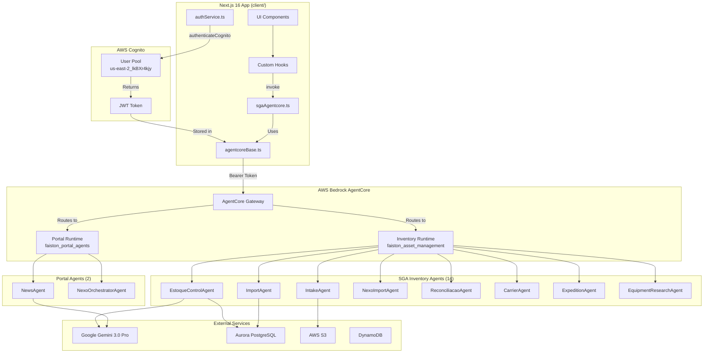

# AgentCore Implementation Guide

Complete guide for implementing AWS Bedrock AgentCore with Google ADK framework in Faiston NEXO.

## Table of Contents

1. [Architecture Overview](#1-architecture-overview)
2. [Authentication Setup](#2-authentication-setup)
3. [AgentCore Client Implementation](#3-agentcore-client-implementation)
4. [Frontend Service Pattern](#4-frontend-service-pattern)
5. [Backend Agent Architecture](#5-backend-agent-architecture)
6. [Deployment and Infrastructure](#6-deployment-and-infrastructure)
7. [Cold Start Optimization](#7-cold-start-optimization)
8. [Troubleshooting Guide](#8-troubleshooting-guide)

---

## 1. Architecture Overview

### System Architecture Diagram



### AWS Configuration

| Setting | Value |
|---------|-------|
| **AWS Account** | `377311924364` |
| **Region** | `us-east-2` |
| **Cognito User Pool** | `us-east-2_lkBXr4kjy` (faiston-users-prod) |
| **Cognito Client ID** | `7ovjm09dr94e52mpejvbu9v1cg` (faiston-client-prod) |

### AgentCore Runtimes

| Runtime | ID | Agents | Purpose |
|---------|-----|--------|---------|
| **Inventory** | `faiston_asset_management-uSuLPsFQNH` | 14 | SGA Inventory management |
| **Academy** | `faiston_academy_agents-ODNvP6HxCD` | 6 | Learning platform |
| **Portal** | `faiston_portal_agents-PENDING` | 2 | Central orchestrator |

### Key Components

| Component | Location | Purpose |
|-----------|----------|---------|
| Auth Service | `client/services/authService.ts` | Cognito authentication |
| AgentCore Base | `client/services/agentcoreBase.ts` | Factory for AgentCore services |
| AgentCore Config | `client/lib/config/agentcore.ts` | Centralized ARN/endpoint config |
| SGA Service | `client/services/sgaAgentcore.ts` | SGA-specific AgentCore calls |
| Inventory Backend | `server/agentcore-inventory/` | SGA agents and tools |
| Portal Backend | `server/agentcore-portal/` | Portal agents |

---

## 2. Authentication Setup

### Cognito Configuration

The Faiston platform uses Amazon Cognito (NOT Amplify) for authentication:

```typescript
// client/services/authService.ts
const COGNITO_CONFIG = {
  userPoolId: 'us-east-2_lkBXr4kjy',
  clientId: '7ovjm09dr94e52mpejvbu9v1cg',
  region: 'us-east-2',
};
```

### JWT Token Flow

1. User logs in via `authService.signIn()`
2. Cognito returns ID Token + Access Token
3. Access Token stored in `sessionStorage`
4. AgentCore Gateway validates token via JWT Authorizer
5. Token refreshed automatically before expiration

### AgentCore JWT Authorizer

The AgentCore Gateway is configured with a custom JWT authorizer:

```python
# Configured via GitHub Actions during deploy
authorizerConfiguration = {
    "customJWTAuthorizer": {
        "discoveryUrl": f"https://cognito-idp.us-east-2.amazonaws.com/{COGNITO_POOL_ID}/.well-known/openid-configuration",
        "allowedClients": [COGNITO_CLIENT_ID]
    }
}
```

---

## 3. AgentCore Client Implementation

### Base Service Factory Pattern

```typescript
// client/services/agentcoreBase.ts
export function createAgentCoreService(config: {
  runtimeArn: string;
  serviceName: string;
}) {
  return {
    invoke: async (action: string, payload: Record<string, unknown>) => {
      const token = sessionStorage.getItem('accessToken');

      const response = await fetch(AGENTCORE_ENDPOINT, {
        method: 'POST',
        headers: {
          'Content-Type': 'application/json',
          'Authorization': `Bearer ${token}`,
          'X-Runtime-ARN': config.runtimeArn,
        },
        body: JSON.stringify({ action, ...payload }),
      });

      return response.json();
    },
  };
}
```

### Centralized Configuration

```typescript
// client/lib/config/agentcore.ts
export const agentCoreConfig = {
  endpoint: 'https://bedrock-agentcore.us-east-2.amazonaws.com',
  region: 'us-east-2',
  accountId: '377311924364',
  arns: {
    academy: 'arn:aws:bedrock-agentcore:us-east-2:377311924364:runtime/faiston_academy_agents-ODNvP6HxCD',
    sga: 'arn:aws:bedrock-agentcore:us-east-2:377311924364:runtime/faiston_asset_management-uSuLPsFQNH',
    portal: 'arn:aws:bedrock-agentcore:us-east-2:377311924364:runtime/faiston_portal_agents-PENDING',
  },
};
```

---

## 4. Frontend Service Pattern

### Module-Specific Services

Each module has its own AgentCore service that uses the base factory:

```typescript
// client/services/sgaAgentcore.ts
import { createAgentCoreService } from './agentcoreBase';
import { SGA_AGENTCORE_ARN } from '@/lib/config/agentcore';

const sgaService = createAgentCoreService({
  runtimeArn: SGA_AGENTCORE_ARN,
  serviceName: 'sga',
});

// Action-specific functions
export async function queryInventory(query: string) {
  return sgaService.invoke('query_inventory', { query });
}

export async function processNF(xmlContent: string) {
  return sgaService.invoke('process_nf', { xml_content: xmlContent });
}

export async function smartImport(file: File, fileType: string) {
  return sgaService.invoke('smart_import', {
    file_content: await file.text(),
    file_type: fileType,
  });
}
```

### Custom Hooks Pattern

```typescript
// client/hooks/ativos/useSmartImporter.ts
import { useMutation } from '@tanstack/react-query';
import { smartImport } from '@/services/sgaAgentcore';

export function useSmartImporter() {
  return useMutation({
    mutationFn: async ({ file, fileType }: { file: File; fileType: string }) => {
      return smartImport(file, fileType);
    },
    onError: (error) => {
      console.error('Smart import failed:', error);
    },
  });
}
```

---

## 5. Backend Agent Architecture

### Agent Structure

All agents extend the Google ADK base and run on AgentCore:

```python
# server/agentcore-inventory/agents/estoque_control_agent.py
from google.adk.agents import Agent
from google.adk.tools import FunctionTool

class EstoqueControlAgent(Agent):
    """Main orchestrator for SGA inventory operations."""

    name = "EstoqueControlAgent"
    model = "gemini-3.0-pro"

    def __init__(self):
        super().__init__(
            name=self.name,
            model=self.model,
            instruction=self._get_system_prompt(),
            tools=self._get_tools(),
        )

    def _get_tools(self) -> list[FunctionTool]:
        # Lazy import to avoid cold start timeout
        from ..tools import (
            query_inventory,
            get_balance,
            create_movement,
        )
        return [query_inventory, get_balance, create_movement]
```

### Main Entrypoint

```python
# server/agentcore-inventory/main.py
from bedrock_agentcore import BedrockAgentCoreApp

app = BedrockAgentCoreApp()

@app.action("query_inventory")
async def handle_query_inventory(request):
    # Lazy import to meet 30s cold start limit
    from agents.estoque_control_agent import EstoqueControlAgent

    agent = EstoqueControlAgent()
    return await agent.run(request.payload)

@app.action("smart_import")
async def handle_smart_import(request):
    from agents.nexo_import_agent import NexoImportAgent

    agent = NexoImportAgent()
    return await agent.run(request.payload)
```

### SGA Inventory Agents (14 total)

| Agent | Purpose | Actions |
|-------|---------|---------|
| EstoqueControlAgent | Main orchestrator | `query_inventory`, `get_dashboard` |
| IntakeAgent | NF-e XML processing | `process_nf`, `validate_nf` |
| ImportAgent | Spreadsheet import | `import_spreadsheet`, `validate_import` |
| NexoImportAgent | Smart AI import | `smart_import`, `learn_from_import` |
| ReconciliacaoAgent | Inventory reconciliation | `reconcile`, `generate_report` |
| ComplianceAgent | Compliance checks | `check_compliance`, `audit` |
| ComunicacaoAgent | Notifications | `notify`, `alert` |
| CarrierAgent | Carrier management | `assign_carrier`, `track_shipment` |
| ExpeditionAgent | Expedition management | `create_expedition`, `plan_route` |
| ReverseAgent | Reverse logistics | `process_return`, `inspect_return` |
| ObservationAgent | Field observations | `record_observation`, `analyze_trend` |
| EquipmentResearchAgent | Equipment KB search | `research_equipment`, `find_manual` |
| LearningAgent | Continuous learning | `learn`, `improve_model` |
| InventoryCountAgent | Stock counting | `count_inventory`, `adjust_stock` |

---

## 6. Deployment and Infrastructure

### GitHub Actions Deployment

Agents are deployed via GitHub Actions workflows:

```yaml
# .github/workflows/deploy-agentcore-inventory.yml
name: Deploy AgentCore Inventory

on:
  push:
    branches: [main]
    paths:
      - 'server/agentcore-inventory/**'
  workflow_dispatch:

jobs:
  deploy:
    runs-on: ubuntu-latest
    steps:
      - uses: actions/checkout@v4
      - uses: aws-actions/configure-aws-credentials@v4
        with:
          aws-region: us-east-2

      - name: Install AgentCore CLI
        run: pip install bedrock-agentcore-starter-toolkit

      - name: Deploy
        run: |
          agentcore deploy --agent faiston_asset_management \
            --env GOOGLE_API_KEY=${{ secrets.GOOGLE_API_KEY }}
```

### Terraform Resources

All AWS resources are managed via Terraform (NOT CloudFormation/SAM):

- **AgentCore Gateway**: `terraform/main/agentcore.tf`
- **Cognito User Pool**: `terraform/main/cognito.tf`
- **Aurora PostgreSQL**: `terraform/main/aurora.tf`
- **S3 Buckets**: `terraform/main/s3.tf`
- **DynamoDB Tables**: `terraform/main/dynamodb.tf`

---

## 7. Cold Start Optimization

### CRITICAL: 30-Second Limit

AgentCore has a **30-second cold start limit**. Exceeding this causes **HTTP 424 errors**.

### DO NOT

```python
# BAD - Heavy imports at module level
from lxml import etree  # Takes 5+ seconds
from bs4 import BeautifulSoup  # Takes 3+ seconds

# BAD - Importing agents in __init__.py
from .estoque_control_agent import EstoqueControlAgent
from .intake_agent import IntakeAgent
```

### DO

```python
# GOOD - Empty __init__.py
# agents/__init__.py
# (leave empty - lazy load agents)

# GOOD - Lazy imports inside handlers
@app.action("process_nf")
async def handle_process_nf(request):
    from agents.intake_agent import IntakeAgent  # Import when needed
    agent = IntakeAgent()
    return await agent.run(request.payload)

# GOOD - Use stdlib instead of heavy libraries
import xml.etree.ElementTree as ET  # Fast, built-in
```

### Pre-Installed Libraries

AgentCore has these libraries pre-installed (no cold start penalty):
- `boto3`, `botocore`
- `httpx`, `aiohttp`
- `pydantic`
- `google-adk`

---

## 8. Troubleshooting Guide

### HTTP 424 - Cold Start Timeout

**Cause**: Agent initialization exceeds 30 seconds.

**Solution**:
1. Check imports in `agents/__init__.py` - should be empty
2. Move all imports inside handler functions
3. Replace heavy libraries with stdlib equivalents
4. Profile with `time python -c "import your_module"`

### HTTP 401 - Unauthorized

**Cause**: Invalid or expired JWT token.

**Solution**:
1. Verify Cognito client ID matches `7ovjm09dr94e52mpejvbu9v1cg`
2. Check token is passed as `Bearer {token}` header
3. Ensure JWT Authorizer is configured on AgentCore runtime
4. Verify token hasn't expired (check `exp` claim)

### HTTP 502/503/504 - Gateway Errors

**Cause**: AgentCore Gateway retry behavior or agent crash.

**Solution**:
1. Check CloudWatch logs for agent errors
2. Implement exponential backoff in frontend service
3. Verify agent doesn't have infinite loops
4. Check memory limits aren't exceeded

### Connection Refused

**Cause**: Missing or incorrect runtime ARN.

**Solution**:
1. Verify ARN in `client/lib/config/agentcore.ts`
2. Check runtime is deployed: `agentcore status --agent faiston_asset_management`
3. Ensure runtime is in `ACTIVE` state

---

## Related Documentation

- [SGA Architecture](../architecture/SGA_ESTOQUE_ARCHITECTURE.md) - Complete SGA module architecture
- [Frontend Auth](../FRONTEND_AUTH.md) - Authentication patterns
- [Troubleshooting](../TROUBLESHOOTING.md) - Extended troubleshooting guide
- [Agent Catalog](../AGENT_CATALOG.md) - Complete agent inventory

---

**Last Updated:** January 2026
**Platform:** Faiston NEXO
**AI Assistant:** NEXO
