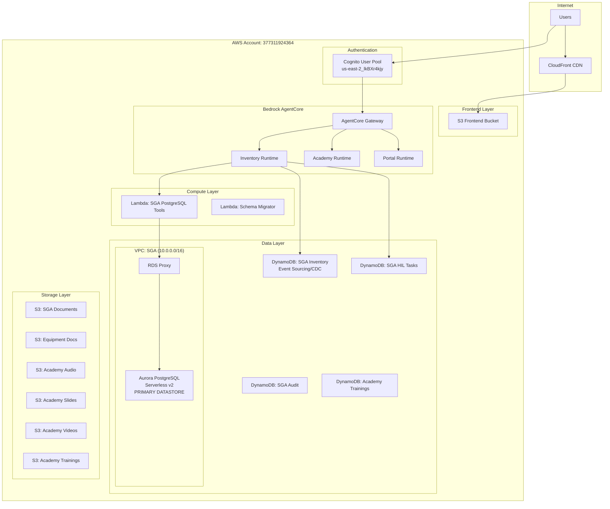

# Infrastructure Documentation - Faiston NEXO

Complete AWS infrastructure documentation for the Faiston NEXO AI-First platform.

## Table of Contents

1. [Overview](#1-overview)
2. [AWS Account Configuration](#2-aws-account-configuration)
3. [AgentCore Infrastructure](#3-agentcore-infrastructure)
4. [Database Infrastructure](#4-database-infrastructure)
5. [Storage Infrastructure](#5-storage-infrastructure)
6. [Networking](#6-networking)
7. [Security](#7-security)
8. [Terraform Structure](#8-terraform-structure)

---

## 1. Overview

### Technology Stack

| Layer | Technology |
|-------|------------|
| **Agent Framework** | AWS Strands Agents + Google ADK v1.0 |
| **LLM** | Gemini 3.0 Family (Pro/Flash) |
| **Agent Runtime** | AWS Bedrock AgentCore |
| **Primary Datastore** | Aurora PostgreSQL Serverless v2 |
| **Secondary Datastore** | DynamoDB (HIL, audit, sessions, CDC) |
| **Inter-Agent Protocol** | A2A (Agent-to-Agent) - JSON-RPC 2.0 |

### Architecture Diagram



### Infrastructure-as-Code

| Principle | Implementation |
|-----------|---------------|
| **Terraform Only** | NO CloudFormation, NO SAM |
| **State Backend** | S3 + DynamoDB locking |
| **Naming Convention** | `{project}-{module}-{resource}-{env}` |
| **Tagging Strategy** | Project, Environment, Module, Feature |

---

## 2. AWS Account Configuration

### Account Details

| Setting | Value |
|---------|-------|
| **Account ID** | `377311924364` |
| **Region** | `us-east-2` (Ohio) |
| **Project Name** | `faiston-one` |
| **Environment** | `prod` |

### Cognito Configuration

| Setting | Value |
|---------|-------|
| **User Pool ID** | `us-east-2_lkBXr4kjy` |
| **User Pool Name** | `faiston-users-prod` |
| **Client ID** | `7ovjm09dr94e52mpejvbu9v1cg` |
| **Client Name** | `faiston-client-prod` |

---

## 3. AgentCore Infrastructure

### AgentCore Runtimes

| Runtime | ID | Purpose | Agents | LLM |
|---------|-----|---------|--------|-----|
| **Inventory** | `faiston_inventory_orchestration-uSuLPsFQNH` | SGA Inventory management | 14 | Gemini 3.0 Pro/Flash |
| **Academy** | `faiston_academy_agents-ODNvP6HxCD` | Learning platform | 6 | Gemini 3.0 Pro/Flash |
| **Portal** | `faiston_portal_agents-PENDING` | Central orchestrator | 2 | Gemini 3.0 Pro/Flash |

> **Note:** All agents use **Gemini 3.0 Family** LLMs (per ADR-003). Critical inventory agents use Gemini 3.0 Pro with thinking enabled. See [Agent Catalog](AGENT_CATALOG.md) for complete agent list and LLM assignments.

### AgentCore Gateway

| Setting | Value |
|---------|-------|
| **Gateway ID** | `faiston-one-sga-gateway-prod-qbnlm3ao63` |
| **Gateway URL** | `https://faiston-one-sga-gateway-prod-qbnlm3ao63.gateway.bedrock-agentcore.us-east-2.amazonaws.com/mcp` |
| **Auth Type** | JWT (Cognito) |
| **Semantic Search** | Enabled |

### MCP Tools (Gateway)

| Tool | Description |
|------|-------------|
| `sga_list_inventory` | List assets and balances with filters |
| `sga_get_balance` | Get stock balance for part number |
| `sga_search_assets` | Search assets by serial/PN/description |
| `sga_get_asset_timeline` | Get full asset history (event sourcing) |
| `sga_get_movements` | List movements with date/type filters |
| `sga_get_pending_tasks` | List HIL approval tasks |
| `sga_create_movement` | Create new stock movement |
| `sga_reconcile_sap` | Compare SGA with SAP export |
| `sga_get_schema_metadata` | PostgreSQL schema introspection |
| `sga_get_table_columns` | Get table column metadata |
| `sga_get_enum_values` | Get ENUM valid values |

---

## 4. Database Infrastructure

> **CRITICAL:** Aurora PostgreSQL is the **PRIMARY DATASTORE** for all inventory data (assets, movements, balances, locations). DynamoDB is used **ONLY** for event sourcing, CDC, HIL tasks, audit logs, and sessions. See [Database Schema](DATABASE_SCHEMA.md) for details.

### Aurora PostgreSQL (SGA Inventory - PRIMARY DATASTORE)

| Setting | Value |
|---------|-------|
| **Engine** | Aurora PostgreSQL Serverless v2 |
| **Engine Version** | 15.x |
| **Database Name** | `sga_inventory` |
| **Cluster ID** | `faiston-one-sga-postgres-prod` |
| **Min ACU** | 0.5 (scales to zero when idle) |
| **Max ACU** | 8.0 |
| **Port** | 5432 |
| **Purpose** | **PRIMARY inventory datastore** |

**Features:**
- Serverless v2 automatic scaling
- Multi-AZ deployment (3 AZs)
- Point-in-Time Recovery (PITR) enabled
- Performance Insights for monitoring
- KMS encryption at rest
- IAM authentication for Lambda

**Schema:**
- `assets` - Serialized inventory items
- `movements` - Immutable event log
- `balances` - Aggregate stock projections
- `locations` - Stock locations
- See [DATABASE_SCHEMA.md](DATABASE_SCHEMA.md) for complete schema

### RDS Proxy

| Setting | Value |
|---------|-------|
| **Name** | `faiston-one-sga-proxy-prod` |
| **Engine Family** | POSTGRESQL |
| **Auth Mode** | IAM (Secrets Manager) |

**Benefits:**
- Connection pooling for Lambda
- Reduced database connection overhead
- Automatic failover handling

### DynamoDB Tables (Secondary Datastores)

> **CRITICAL NOTE:** DynamoDB tables are **SECONDARY** datastores. They do NOT hold primary inventory data. Primary inventory queries go to Aurora PostgreSQL.

| Table | Purpose | Billing | Keys |
|-------|---------|---------|------|
| `faiston-one-sga-inventory-prod` | **Event sourcing / CDC only** (NOT primary queries) | On-Demand | PK, SK |
| `faiston-one-sga-hil-tasks-prod` | Human-in-Loop tasks | On-Demand | task_id |
| `faiston-one-sga-audit-log-prod` | Audit trail | On-Demand | PK, SK |
| `faiston-one-sga-sessions-prod` | AgentCore sessions | On-Demand | session_id |
| `faiston-one-academy-trainings-prod` | Custom trainings | On-Demand | training_id |

### DynamoDB Entity Prefixes (Single-Table Design)

| Prefix | Entity | Description |
|--------|--------|-------------|
| `PN#` | Part Number | Catalog entries |
| `ASSET#` | Asset | Serialized items with lifecycle |
| `LOC#` | Location | Stock locations |
| `BALANCE#` | Balance | Quantity projections |
| `MOVE#` | Movement | Immutable event records |
| `RESERVE#` | Reservation | Temporary reservations (TTL) |
| `TASK#` | Task | Pending approvals |
| `DIV#` | Divergence | Anomalies/issues |
| `DOC#` | Document | NFs, photos, evidence |

---

## 5. Storage Infrastructure

### S3 Buckets

| Bucket | Purpose | CORS |
|--------|---------|------|
| `faiston-one-frontend-prod` | Next.js SPA hosting | CloudFront only |
| `faiston-one-sga-documents-prod` | SGA document storage | AgentCore |
| `faiston-one-sga-equipment-docs-prod` | Equipment manuals (KB) | AgentCore |
| `faiston-one-academy-audio-prod` | Audio lessons (ElevenLabs) | CloudFront + localhost |
| `faiston-one-academy-slides-prod` | Slide presentations | CloudFront + localhost |
| `faiston-one-academy-videos-prod` | Video lessons | CloudFront + localhost |
| `faiston-one-academy-trainings-prod` | Custom training content | CloudFront + localhost |

### CloudFront Distribution

| Setting | Value |
|---------|-------|
| **Origin** | S3 Frontend Bucket |
| **Price Class** | PriceClass_100 (North America, Europe) |
| **SSL** | CloudFront default certificate |
| **SPA Routing** | 403/404 → /index.html |

---

## 6. Networking

### VPC Configuration (SGA)

| Setting | Value |
|---------|-------|
| **VPC CIDR** | `10.0.0.0/16` |
| **Name** | `faiston-one-sga-vpc-prod` |
| **DNS Support** | Enabled |
| **DNS Hostnames** | Enabled |

### Subnets

| Type | CIDR Range | AZs | Purpose |
|------|------------|-----|---------|
| **Database** | `10.0.10.x/24`, `10.0.11.x/24`, `10.0.12.x/24` | 3 | Aurora PostgreSQL |
| **Lambda** | `10.0.20.x/24`, `10.0.21.x/24`, `10.0.22.x/24` | 3 | VPC Lambda functions |

### VPC Endpoints

| Endpoint | Service | Type |
|----------|---------|------|
| Secrets Manager | `secretsmanager` | Interface |
| RDS | `rds` | Interface |
| SSM | `ssm` | Interface |

---

## 7. Security

### IAM Roles

| Role | Purpose | Principal |
|------|---------|-----------|
| `faiston-one-sga-gateway-role-prod` | AgentCore Gateway | `bedrock-agentcore.amazonaws.com` |
| `faiston-one-sga-postgres-tools-role-prod` | Lambda execution | `lambda.amazonaws.com` |
| `faiston-one-sga-rds-monitoring-role-prod` | RDS Enhanced Monitoring | `monitoring.rds.amazonaws.com` |

### KMS Keys

| Key | Purpose | Alias |
|-----|---------|-------|
| SGA RDS | Aurora encryption | `alias/faiston-one-sga-rds-prod` |

### Security Groups

| Security Group | Ingress | Egress |
|----------------|---------|--------|
| `sga-aurora` | PostgreSQL (5432) from Lambda SG | All |
| `sga-lambda` | None | PostgreSQL to Aurora SG, HTTPS to VPC endpoints |

### Secrets Manager

| Secret | Purpose |
|--------|---------|
| `/faiston-one/sga/rds/master` | Aurora master password |

### SSM Parameters

| Parameter | Purpose |
|-----------|---------|
| `/faiston-one/sga/gateway/config` | Gateway configuration |
| `/faiston-one/sga/gateway/tools` | MCP tool definitions |
| `/faiston-one/academy/elevenlabs/api-key` | ElevenLabs API key |
| `/faiston-one/academy/google/api-key` | Google API key |

---

## 8. Terraform Structure

### Directory Layout

```
terraform/
├── main/
│   ├── main.tf                    # Provider configuration
│   ├── variables.tf               # Input variables
│   ├── locals.tf                  # Local values and CORS config
│   ├── outputs.tf                 # Output values
│   │
│   ├── # Frontend
│   ├── cloudfront.tf              # CloudFront distribution
│   ├── s3.tf                      # Frontend S3 bucket
│   │
│   ├── # AgentCore
│   ├── agentcore_gateway.tf       # AgentCore Gateway configuration
│   ├── iam_sga_agentcore.tf       # AgentCore IAM roles
│   │
│   ├── # SGA Database
│   ├── vpc_sga.tf                 # VPC for RDS
│   ├── security_groups_sga.tf     # Security groups
│   ├── rds_aurora_sga.tf          # Aurora PostgreSQL cluster
│   ├── rds_proxy_sga.tf           # RDS Proxy
│   ├── kms_sga_rds.tf             # KMS key for RDS
│   ├── secretsmanager_sga_rds.tf  # Master password
│   │
│   ├── # SGA DynamoDB
│   ├── dynamodb_sga_inventory.tf  # Inventory table
│   ├── dynamodb_sga_hil.tf        # HIL tasks table
│   ├── dynamodb_sga_audit.tf      # Audit log table
│   ├── dynamodb_sga_sessions.tf   # Sessions table
│   │
│   ├── # SGA Storage
│   ├── s3_sga_documents.tf        # Document storage
│   ├── s3_sga_equipment_docs.tf   # Equipment KB storage
│   │
│   ├── # SGA Lambda
│   ├── lambda_sga_postgres_tools.tf   # PostgreSQL MCP tools
│   ├── lambda_sga_schema_migrator.tf  # Schema migrations
│   │
│   ├── # Academy
│   ├── dynamodb_academy.tf        # Academy trainings table
│   ├── s3_academy_audio.tf        # Audio storage
│   ├── s3_academy_slides.tf       # Slides storage
│   ├── s3_academy_videos.tf       # Videos storage
│   ├── s3_academy_trainings.tf    # Trainings storage
│   ├── ssm_academy.tf             # Academy SSM parameters
│   ├── bedrock_academy_iam.tf     # Academy IAM
│   │
│   └── # IAM
│       └── iam.tf                 # General IAM configuration
│       └── iam_bedrock_kb.tf      # Bedrock KB IAM
```

### Deployment Commands

```bash
# Initialize
cd terraform/main
terraform init

# Plan changes
terraform plan -out=tfplan

# Apply changes (via GitHub Actions)
terraform apply tfplan

# Destroy (with confirmation)
terraform destroy
```

### GitHub Actions Workflow

Infrastructure changes are deployed via GitHub Actions:

1. **PR Created**: `terraform plan` runs automatically
2. **PR Approved**: Manual approval required
3. **Merge to Main**: `terraform apply` executes

---

## Related Documentation

- [Agent Catalog](AGENT_CATALOG.md) - Complete list of all agents and their LLM assignments
- [Database Schema](DATABASE_SCHEMA.md) - PostgreSQL schema and data model
- [AgentCore Implementation Guide](AgentCore/IMPLEMENTATION_GUIDE.md)
- [SGA Architecture](architecture/SGA_ESTOQUE_ARCHITECTURE.md)
- [ADR-003: Gemini Model Selection](architecture/ADR-003-gemini-model-selection.md)
- [Troubleshooting](TROUBLESHOOTING.md)

---

**Last Updated:** January 2026
**Platform:** Faiston NEXO
**IaC:** Terraform
