# Arquitetura do Módulo SGA Estoque - Faiston NEXO

## Visão Geral

O módulo **SGA Estoque** (Sistema de Gestão de Ativos - Estoque) é um sistema completo de gestão de inventário com recursos de IA, workflows de aprovação humana (HIL), e suporte offline/PWA.

---

## 1. Arquitetura de Alto Nível

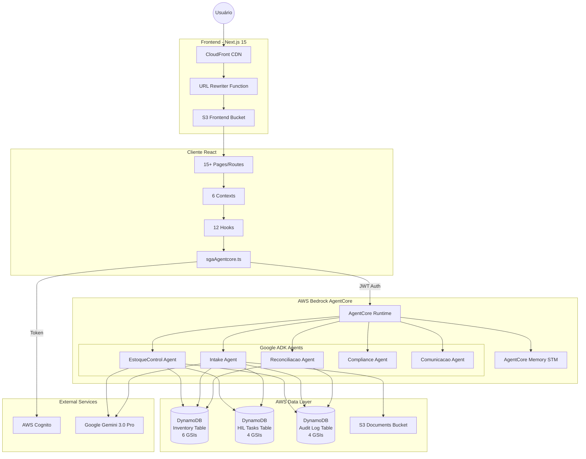

---

## 2. Estrutura de Rotas do Frontend

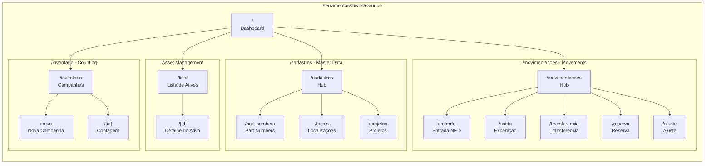

---

## 3. Hierarquia de Context Providers

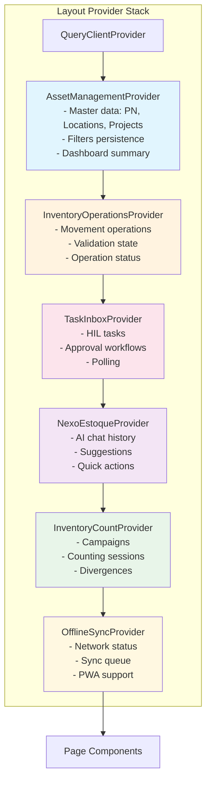

---

## 4. Arquitetura dos Agentes Backend (Google ADK)

```mermaid
flowchart TB
    subgraph "main.py - 40 Actions Router"
        Router{Action Router}
    end

    subgraph "EstoqueControlAgent"
        EC1[create_reservation]
        EC2[cancel_reservation]
        EC3[process_expedition]
        EC4[create_transfer]
        EC5[process_return]
        EC6[query_balance]
        EC7[query_asset_location]
    end

    subgraph "IntakeAgent"
        IA1[process_nf_upload]
        IA2[validate_nf_extraction]
        IA3[confirm_nf_entry]
        IA4[_match_items_to_pn]
    end

    subgraph "ReconciliacaoAgent"
        RA1[start_campaign]
        RA2[submit_count_result]
        RA3[analyze_divergences]
        RA4[propose_adjustment]
    end

    subgraph "ComplianceAgent"
        CA1[validate_operation]
        CA2[check_approval_hierarchy]
        CA3[check_restricted_locations]
    end

    subgraph "ComunicacaoAgent"
        CM1[send_notification]
        CM2[send_reminder]
        CM3[send_escalation]
    end

    subgraph "Tools"
        DDB[SGADynamoDBClient]
        S3C[SGAS3Client]
        HIL[HILWorkflowManager]
        NFP[NFParser]
    end

    Router --> EC1 & EC2 & EC3 & EC4 & EC5 & EC6 & EC7
    Router --> IA1 & IA2 & IA3
    Router --> RA1 & RA2 & RA3 & RA4
    Router --> CA1
    Router --> CM1 & CM2 & CM3

    EC1 & EC2 & EC3 & EC4 & EC5 --> DDB & HIL
    IA1 & IA2 & IA3 --> DDB & S3C & NFP & HIL
    RA1 & RA2 & RA3 & RA4 --> DDB & HIL
    CA1 --> DDB
    CM1 & CM2 --> DDB
```

---

## 5. Modelo de Dados DynamoDB (Single-Table Design)

```mermaid
erDiagram
    INVENTORY_TABLE {
        string PK "ENTITY#id"
        string SK "METADATA | context#key"
        string GSI1PK "SERIAL#serial_number"
        string GSI2PK "LOC#location_id"
        string GSI3PK "PROJ#project_id"
        string GSI4PK "STATUS#status"
        string GSI5PK "DATE#YYYY-MM"
        string GSI6PK "TIMELINE#asset_id"
        number ttl "TTL for reservations"
    }

    HIL_TASKS_TABLE {
        string PK "TASK#task_id"
        string SK "METADATA | COMMENT#ts"
        string GSI1PK "ASSIGNEE#user_id"
        string GSI2PK "STATUS#status"
        string GSI3PK "TYPE#task_type"
        string GSI4PK "REF#entity#id"
        number ttl "90d approved, 30d expired"
    }

    AUDIT_LOG_TABLE {
        string PK "LOG#YYYY-MM-DD"
        string SK "timestamp#event_id"
        string GSI1PK "ACTOR#type#id"
        string GSI2PK "ENTITY#type#id"
        string GSI3PK "TYPE#event_type"
        string GSI4PK "SESSION#session_id"
    }

    INVENTORY_TABLE ||--o{ HIL_TASKS_TABLE : "creates tasks"
    INVENTORY_TABLE ||--o{ AUDIT_LOG_TABLE : "logs events"
    HIL_TASKS_TABLE ||--o{ AUDIT_LOG_TABLE : "logs decisions"
```

### Prefixos de Entidade (PK Pattern)

| Prefixo | Entidade | Exemplo PK |
|---------|----------|------------|
| `PN#` | Part Number | `PN#pn_001` |
| `ASSET#` | Ativo Serializado | `ASSET#asset_123` |
| `LOC#` | Localização | `LOC#loc_warehouse_01` |
| `BALANCE#` | Saldo Projetado | `BALANCE#pn_001#loc_01` |
| `MOVE#` | Movimento (Imutável) | `MOVE#move_456` |
| `RESERVE#` | Reserva (TTL) | `RESERVE#res_789` |
| `TASK#` | Tarefa HIL | `TASK#task_abc` |
| `DIV#` | Divergência | `DIV#div_xyz` |
| `DOC#` | Documento | `DOC#nf_12345` |
| `PROJ#` | Projeto | `PROJ#proj_cliente_01` |

---

## 6. Fluxo de Entrada via NF-e

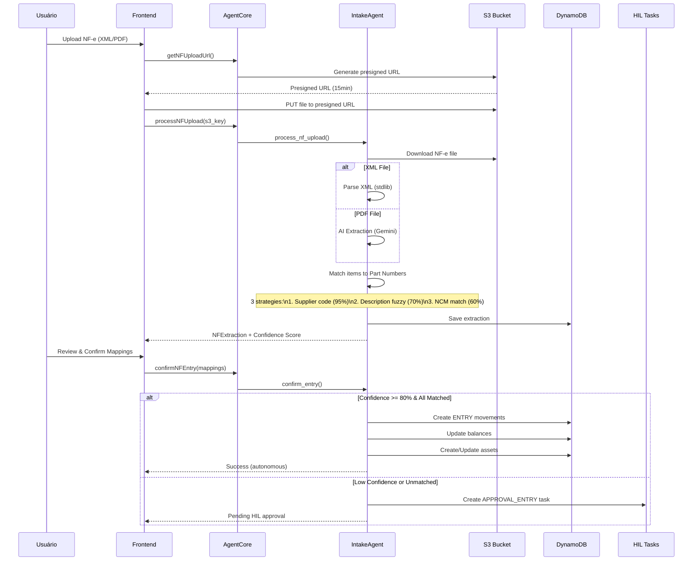

---

## 7. Fluxo de Reserva e Expedição

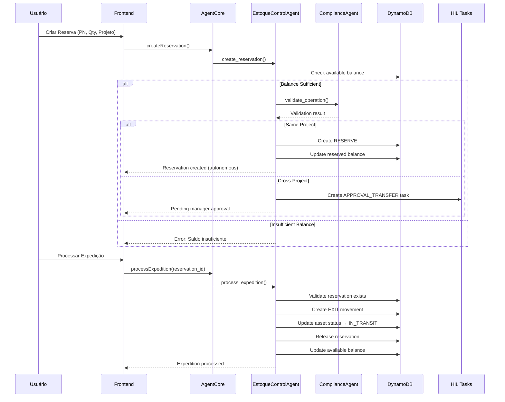

---

## 8. Fluxo de Contagem de Inventário

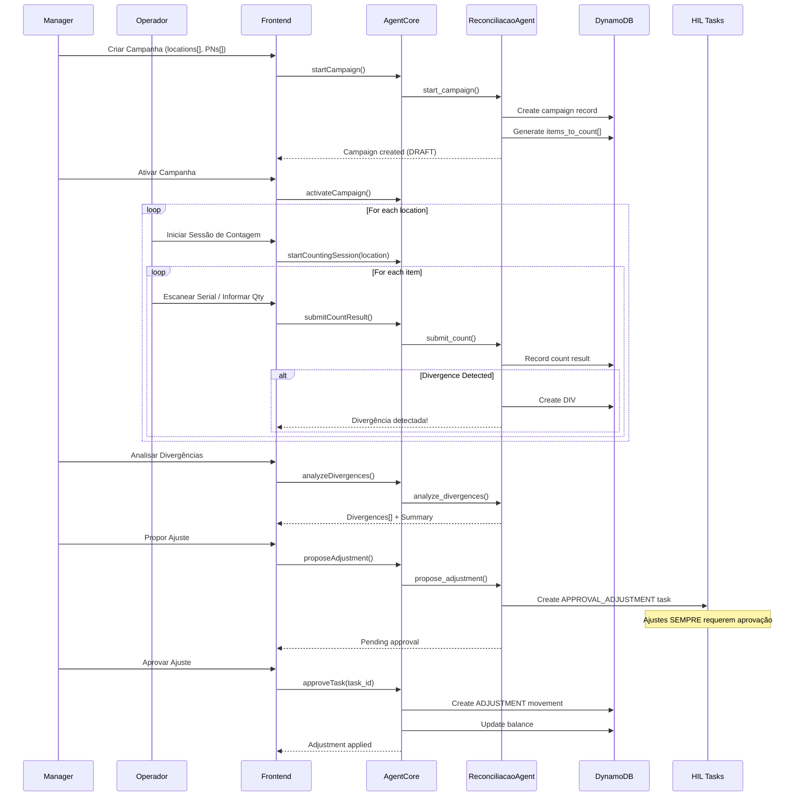

---

## 9. Workflow HIL (Human-in-the-Loop)

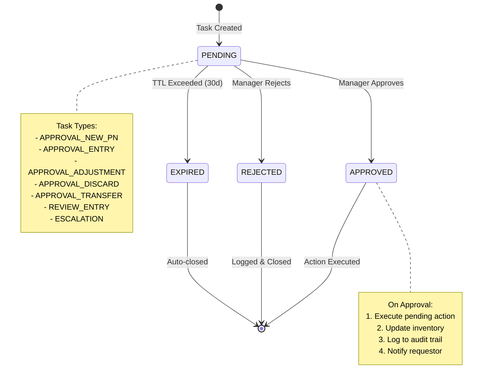

### Matriz de Decisão HIL

| Operação | Condição | Decisão |
|----------|----------|---------|
| Reserva mesmo projeto | - | ✅ Autônomo |
| Reserva cross-project | - | 🔒 HIL Obrigatório |
| Transferência normal | - | ✅ Autônomo |
| Transferência p/ COFRE/QUARENTENA | - | 🔒 HIL Obrigatório |
| Entrada NF-e | Confidence ≥ 80% | ✅ Autônomo |
| Entrada NF-e | Confidence < 80% | 🔒 HIL Obrigatório |
| Entrada NF-e | Itens não mapeados | 🔒 HIL Obrigatório |
| Ajuste de inventário | Qualquer | 🔒 **SEMPRE** HIL |
| Descarte/Perda | Qualquer | 🔒 **SEMPRE** HIL |
| Novo Part Number | Qualquer | 🔒 HIL Obrigatório |

---

## 10. Estrutura S3 Documents

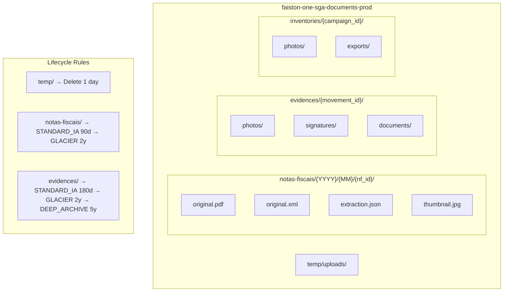

---

## 11. Componentes Frontend Chave

### NEXO AI Components

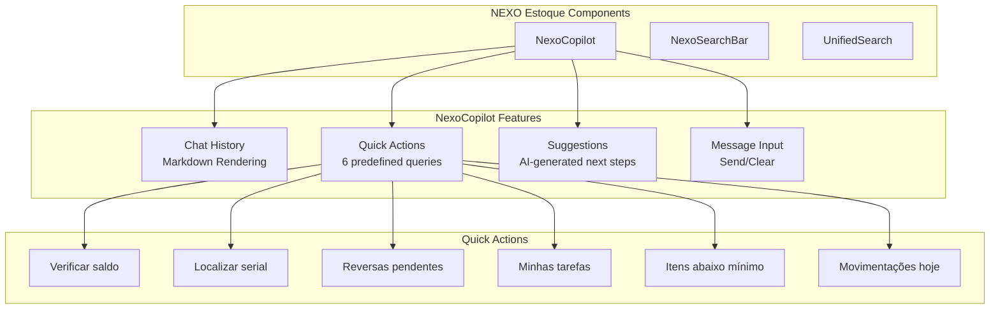

### Mobile/PWA Components

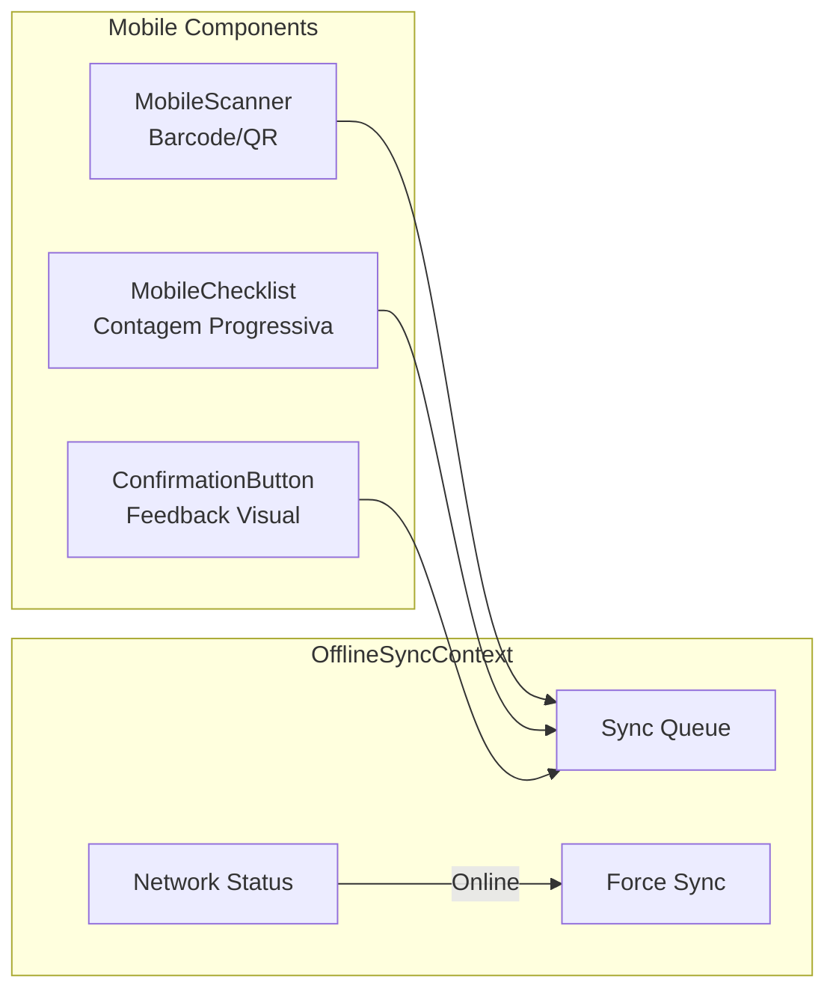

---

## 12. Resumo da Infraestrutura AWS

| Recurso | Nome | Propósito |
|---------|------|-----------|
| **DynamoDB** | `faiston-one-sga-inventory-prod` | Tabela principal (6 GSIs, Streams) |
| **DynamoDB** | `faiston-one-sga-hil-tasks-prod` | Tarefas de aprovação (4 GSIs) |
| **DynamoDB** | `faiston-one-sga-audit-log-prod` | Audit trail imutável (4 GSIs) |
| **S3** | `faiston-one-sga-documents-prod` | NF-e, evidências, fotos |
| **IAM Role** | `faiston-one-sga-agentcore-role` | Execução AgentCore |
| **CloudFront** | `faiston-one-cdn` | CDN com URL Rewriter |
| **Cognito** | Pool compartilhado | Autenticação JWT |

### Região e Conta

- **AWS Account**: `377311924364`
- **Region**: `us-east-2` (Ohio)
- **Terraform State**: S3 + DynamoDB locking

---

## Arquivos Relacionados

### Frontend
- **Routes**: `client/app/(main)/ferramentas/ativos/estoque/`
- **Components**: `client/components/ferramentas/ativos/estoque/`
- **Contexts**: `client/contexts/ativos/`
- **Hooks**: `client/hooks/ativos/`
- **Services**: `client/services/sgaAgentcore.ts`
- **Types**: `client/lib/ativos/types.ts`

### Backend
- **Main**: `server/agentcore-inventory/main.py`
- **Agents**: `server/agentcore-inventory/agents/`
- **Tools**: `server/agentcore-inventory/tools/`

### Infrastructure
- **DynamoDB**: `terraform/main/dynamodb_sga_*.tf`
- **S3**: `terraform/main/s3_sga_documents.tf`
- **IAM**: `terraform/main/iam_sga_agentcore.tf`
- **CloudFront**: `terraform/main/cloudfront.tf`

---

*Documento gerado em: 2026-01-04*
*Versão: 1.0*
