# SGA Inventory Module Architecture - Faiston NEXO

## Overview

The **SGA Inventory** module (Asset Management System - Inventory) is a complete inventory management system with AI capabilities, human-in-the-loop (HIL) approval workflows, and offline/PWA support.

**Technology Stack:**
- **Framework:** AWS Strands Agents Framework + Google ADK v1.0
- **Models:** Gemini 3.0 Pro (with Thinking) + Gemini 3.0 Flash
- **Memory:** AgentCore Memory (Session + STM + LTM + RAG)
- **Communication:** A2A Protocol (JSON-RPC 2.0) on Port 9000
- **Primary Datastore:** Aurora PostgreSQL (inventory data)
- **Secondary Datastore:** DynamoDB (HIL tasks, audit logs, sessions)

---

## 1. High-Level Architecture

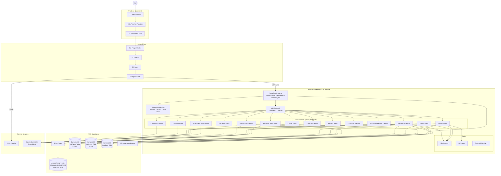

---

## 2. Frontend Route Structure

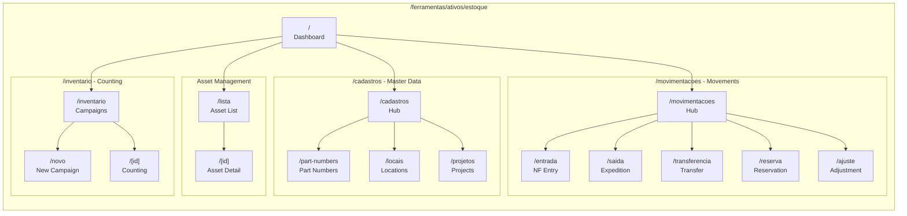

---

## 3. Context Provider Hierarchy

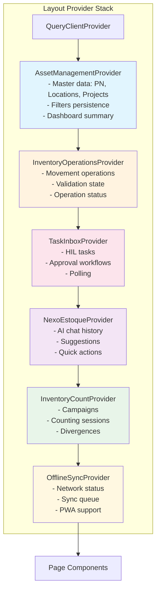

---

## 4. Backend Agent Architecture (AWS Strands Agents)

```mermaid
flowchart TB
    subgraph "main.py - AgentCore Entry Point"
        Entry[@app.entrypoint\nA2A Handler]
        Router{Action Router}
    end

    subgraph "EstoqueControlAgent (Flash)"
        EC1[create_reservation]
        EC2[cancel_reservation]
        EC3[process_expedition]
        EC4[create_transfer]
        EC5[process_return]
        EC6[query_balance]
        EC7[query_asset_location]
    end

    subgraph "IntakeAgent (Pro + Thinking)"
        IA1[process_nf_upload]
        IA2[validate_nf_extraction]
        IA3[confirm_nf_entry]
        IA4[_match_items_to_pn]
    end

    subgraph "ImportAgent (Pro + Thinking)"
        IMP1[preview_import]
        IMP2[execute_import]
        IMP3[process_text_import]
        IMP4[_map_columns]
        IMP5[_extract_with_gemini]
    end

    subgraph "NexoImportAgent (Pro + Thinking)"
        NI1[smart_import_upload]
        NI2[validate_schema]
        NI3[interactive_qa]
        NI4[learn_from_import]
    end

    subgraph "ReconciliationAgent (Flash)"
        RA1[start_campaign]
        RA2[submit_count_result]
        RA3[analyze_divergences]
        RA4[propose_adjustment]
    end

    subgraph "ComplianceAgent (Pro)"
        CA1[validate_operation]
        CA2[check_approval_hierarchy]
        CA3[check_restricted_locations]
    end

    subgraph "CarrierAgent (Flash)"
        CR1[manage_carriers]
        CR2[track_shipment]
    end

    subgraph "ExpeditionAgent (Flash)"
        EX1[process_outbound]
        EX2[generate_shipping_label]
    end

    subgraph "ReverseAgent (Flash)"
        RV1[process_return]
        RV2[handle_reverse_logistics]
    end

    subgraph "ObservationAgent (Flash)"
        OB1[record_field_observation]
        OB2[analyze_patterns]
    end

    subgraph "EquipmentResearchAgent (Flash)"
        EQ1[search_equipment_kb]
        EQ2[find_specifications]
    end

    subgraph "LearningAgent (Pro + Thinking)"
        LA1[continuous_learning]
        LA2[improve_predictions]
        LA3[retrieve_prior_knowledge]
        LA4[create_episode]
    end

    subgraph "SchemaEvolutionAgent (Pro + Thinking)"
        SE1[create_column]
        SE2[modify_schema]
        SE3[validate_migration]
    end

    subgraph "ValidationAgent (Flash)"
        VA1[validate_data]
        VA2[check_constraints]
        VA3[verify_quality]
    end

    subgraph "Tools"
        PG[PostgreSQL Client]
        DDB[DynamoDB Client]
        S3C[S3 Client]
        HIL[HIL Workflow Manager]
        NFP[NFParser]
        FD[FileDetector]
    end

    Entry --> Router
    Router --> EC1 & EC2 & EC3 & EC4 & EC5 & EC6 & EC7
    Router --> IA1 & IA2 & IA3
    Router --> IMP1 & IMP2 & IMP3
    Router --> NI1 & NI2 & NI3 & NI4
    Router --> RA1 & RA2 & RA3 & RA4
    Router --> CA1
    Router --> CR1 & CR2
    Router --> EX1 & EX2
    Router --> RV1 & RV2
    Router --> OB1 & OB2
    Router --> EQ1 & EQ2
    Router --> LA1 & LA2 & LA3 & LA4
    Router --> SE1 & SE2 & SE3
    Router --> VA1 & VA2 & VA3

    EC1 & EC2 & EC3 & EC4 & EC5 --> PG & HIL
    IA1 & IA2 & IA3 --> PG & S3C & NFP & HIL
    IMP1 & IMP2 & IMP3 --> PG & S3C & FD & HIL
    NI1 & NI2 & NI3 & NI4 --> PG & S3C & FD & HIL
    RA1 & RA2 & RA3 & RA4 --> PG & HIL
    CA1 --> PG
    LA1 & LA2 & LA3 & LA4 --> DDB
    SE1 & SE2 & SE3 --> PG
    VA1 & VA2 & VA3 --> PG
```

---

## 5. Data Architecture

### Database Responsibilities

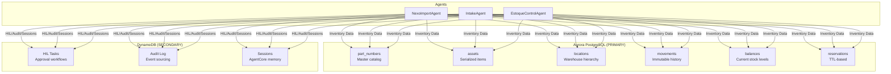

### PostgreSQL Schema (PRIMARY DATASTORE)

```mermaid
erDiagram
    PART_NUMBERS ||--o{ ASSETS : "defines"
    PART_NUMBERS ||--o{ MOVEMENTS : "tracks"
    PART_NUMBERS ||--o{ BALANCES : "stock"
    ASSETS ||--o{ MOVEMENTS : "history"
    LOCATIONS ||--o{ ASSETS : "contains"
    LOCATIONS ||--o{ MOVEMENTS : "from/to"
    LOCATIONS ||--o{ BALANCES : "stored_at"
    PART_NUMBERS ||--o{ RESERVATIONS : "reserves"
    LOCATIONS ||--o{ RESERVATIONS : "location"

    PART_NUMBERS {
        uuid pn_id PK
        varchar pn_code UNIQUE
        text description
        varchar uom
        varchar category
        jsonb metadata
    }

    ASSETS {
        uuid asset_id PK
        uuid pn_id FK
        varchar serial_number UNIQUE
        uuid location_id FK
        enum status
        enum condition
        jsonb metadata
    }

    LOCATIONS {
        uuid location_id PK
        varchar name
        varchar code UNIQUE
        enum type
        uuid parent_id FK
    }

    MOVEMENTS {
        uuid movement_id PK
        uuid asset_id FK
        uuid pn_id FK
        enum type
        integer quantity
        uuid from_location_id FK
        uuid to_location_id FK
        decimal confidence_score
        uuid hil_task_id
    }

    BALANCES {
        uuid balance_id PK
        uuid pn_id FK
        uuid location_id FK
        integer quantity
        integer reserved_quantity
        integer available_quantity
    }

    RESERVATIONS {
        uuid reservation_id PK
        uuid pn_id FK
        uuid location_id FK
        integer quantity
        enum status
        timestamptz expires_at
    }
```

### DynamoDB Tables (SECONDARY - Event/Workflow Data)

```mermaid
erDiagram
    HIL_TASKS_TABLE {
        string PK "TASK#task_id"
        string SK "METADATA | COMMENT#ts"
        string GSI1PK "ASSIGNEE#user_id"
        string GSI2PK "STATUS#status"
        string GSI3PK "TYPE#task_type"
        string GSI4PK "REF#entity#id"
        number ttl "90d approved, 30d expired"
    }

    AUDIT_LOG_TABLE {
        string PK "LOG#YYYY-MM-DD"
        string SK "timestamp#event_id"
        string GSI1PK "ACTOR#type#id"
        string GSI2PK "ENTITY#type#id"
        string GSI3PK "TYPE#event_type"
        string GSI4PK "SESSION#session_id"
    }

    SESSIONS_TABLE {
        string session_id PK
        string user_id
        string agent_name
        map memory
        string created_at
        string expires_at
        number TTL
    }

    HIL_TASKS_TABLE ||--o{ AUDIT_LOG_TABLE : "logs decisions"
```

---

## 6. A2A Protocol (TRUE Multi-Agent A2A Architecture)

### Architecture Overview

The SGA Inventory module uses **TRUE Multi-Agent A2A** architecture where:
- Each of 14 agents has its **OWN** `main.py` with Strands `A2AServer`
- **ORCHESTRATOR** (nexo_import) receives user requests and routes to specialists
- **SPECIALISTS** focus on specific domains (NF parsing, spreadsheet import, inventory control, memory)
- **SUPPORT** agents provide auxiliary functionality (validation, compliance, etc.)
- **ReAct Pattern**: OBSERVE→THINK→LEARN→EXECUTE + Human-in-the-Loop (HIL)

### Agent Roles

| Role | Agent(s) | Description |
|------|----------|-------------|
| **ORCHESTRATOR** | nexo_import | Routes requests to specialists, coordinates workflows |
| **SPECIALIST** | intake | NF-e parsing (XML, PDF, DANFE images via Gemini Vision) |
| **SPECIALIST** | import | CSV/XLSX bulk import with column mapping |
| **SPECIALIST** | estoque_control | Inventory movements, reservations, transfers |
| **SPECIALIST** | learning | AgentCore Memory (episodes, patterns, thresholds) |
| **SUPPORT** | validation | Schema and data validation |
| **SUPPORT** | compliance | Regulatory compliance checks |
| **SUPPORT** | observation | Audit trail and event logging |
| **SUPPORT** | schema_evolution | Dynamic column creation |
| **SUPPORT** | equipment_research | Equipment KB search |
| **SUPPORT** | carrier | Carrier management |
| **SUPPORT** | expedition | Outbound shipments |
| **SUPPORT** | reverse | Returns processing |
| **SUPPORT** | reconciliacao | SAP reconciliation |

### Configuration

| Property | Value |
|----------|-------|
| **Protocol** | JSON-RPC 2.0 |
| **Transport** | HTTP/HTTPS |
| **Port** | 9000 (per-agent) |
| **Entry Point** | `agents/<agent_id>/main.py` with Strands `A2AServer` |
| **Server** | `strands.multiagent.a2a.A2AServer` (serve_at_root=True) |
| **Discovery** | AWS Systems Manager Parameter Store (SSM) |
| **Authentication** | AWS IAM SigV4 + Cognito JWT |
| **Agent Card** | `/.well-known/agent-card.json` (A2A standard) |

### TRUE Multi-Agent A2A Flow

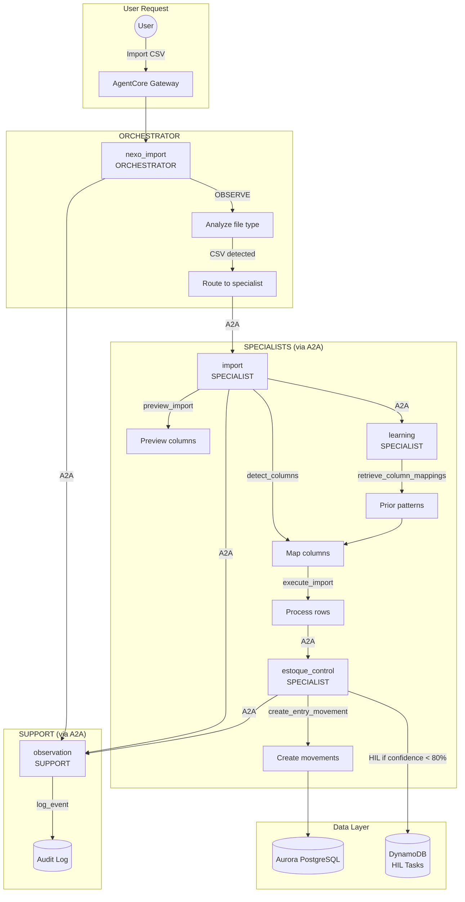

### Message Format

```json
{
  "jsonrpc": "2.0",
  "method": "invoke_agent",
  "params": {
    "agent_id": "nexo_import",
    "action": "analyze_file",
    "payload": {
      "s3_key": "uploads/inventory.xlsx",
      "filename": "inventory.xlsx",
      "user_id": "user@example.com"
    }
  },
  "id": "req-123456"
}
```

### Common A2A Patterns

| Source Agent | Target Agent | Action | Purpose |
|--------------|--------------|--------|---------|
| NexoImportAgent | LearningAgent | `retrieve_prior_knowledge` | Get learned mappings |
| NexoImportAgent | LearningAgent | `create_episode` | Store learning episode |
| NexoImportAgent | SchemaEvolutionAgent | `create_column` | Add database column |
| IntakeAgent | ValidationAgent | `validate_data` | Validate NF-e items |
| EstoqueControlAgent | ReconciliacaoAgent | `reconcile` | SAP comparison |

### References

- [AWS Strands Agents A2A Documentation](https://strandsagents.com/latest/documentation/docs/user-guide/concepts/multi-agent/agent-to-agent/)
- [A2A Protocol Specification](https://aws.amazon.com/blogs/opensource/open-protocols-for-agent-interoperability-part-4-inter-agent-communication-on-a2a/)
- [Leveraging A2A with Strands](https://builder.aws.com/content/2y90GhUwgOEbKULKuehf2WHUf9Q/leveraging-agent-to-agent-a2a-with-strands-part-1)

---

## 7. AgentCore Memory Architecture

### Memory Types

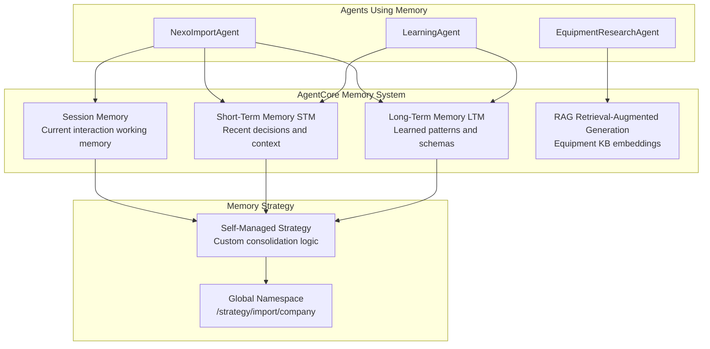

### Memory Configuration

| Agent | Session | STM | LTM | RAG | Strategy |
|-------|---------|-----|-----|-----|----------|
| **NexoImportAgent** | Yes | Yes | Yes | No | Self-Managed |
| **LearningAgent** | Yes | Yes | Yes | No | Self-Managed |
| **EquipmentResearchAgent** | Yes | No | No | Yes | Built-in |
| **Other Agents** | Yes | No | No | No | Built-in |

### Namespace Design

All import-related agents share a **GLOBAL namespace** to enable cross-company learning:

```
/strategy/import/company
```

This allows:
- Learned column mappings to be shared across companies
- Equipment patterns to be recognized globally
- Schema evolution patterns to be reused

### References

- [NEXO Memory Architecture](./NEXO_MEMORY_ARCHITECTURE.md)
- [ADR-001: GLOBAL Namespace Design](./ADR-001-global-namespace.md)
- [ADR-002: Self-Managed Strategy Pattern](./ADR-002-self-managed-strategy.md)
- [AWS Bedrock AgentCore Memory Documentation](https://docs.aws.amazon.com/bedrock-agentcore/latest/devguide/memory.html)

---

## 8. Gemini Model Selection

### Model Assignment Matrix (per ADR-003)

| Category | Model | Thinking | Count | Agents |
|----------|-------|----------|-------|--------|
| **Import/Analysis** | `gemini-3.0-pro` | HIGH | 5 | nexo_import, intake, import, learning, schema_evolution |
| **Complex Reasoning** | `gemini-3.0-pro` | None | 1 | compliance |
| **Operational** | `gemini-3.0-flash` | None | 8 | observation, validation, equipment_research, estoque_control, expedition, reverse, carrier, reconciliacao |

### Agent Model Configuration

| # | Agent | Model | Thinking | Purpose | Path |
|---|-------|-------|----------|---------|------|
| 1 | EstoqueControlAgent | Flash | None | Main orchestrator for inventory | `dist/estoque_control/` |
| 2 | NexoImportAgent | **Pro** | **HIGH** | Smart import orchestrator | `dist/nexo_import/` |
| 3 | IntakeAgent | **Pro** | **HIGH** | NF-e XML processing | `dist/intake/` |
| 4 | ImportAgent | **Pro** | **HIGH** | Spreadsheet import (Excel/CSV) | `dist/import/` |
| 5 | LearningAgent | **Pro** | **HIGH** | Memory management and learning | `dist/learning/` |
| 6 | SchemaEvolutionAgent | **Pro** | **HIGH** | Dynamic schema evolution | `dist/schema_evolution/` |
| 7 | ValidationAgent | Flash | None | Data validation | `dist/validation/` |
| 8 | ComplianceAgent | **Pro** | None | Regulatory compliance | `dist/compliance/` |
| 9 | ReconciliacaoAgent | Flash | None | SAP reconciliation | `dist/reconciliacao/` |
| 10 | ObservationAgent | Flash | None | Field observations | `dist/observation/` |
| 11 | EquipmentResearchAgent | Flash | None | Equipment knowledge base | `dist/equipment_research/` |
| 12 | CarrierAgent | Flash | None | Carrier management | `dist/carrier/` |
| 13 | ExpeditionAgent | Flash | None | Expedition planning | `dist/expedition/` |
| 14 | ReverseAgent | Flash | None | Reverse logistics | `dist/reverse/` |

**Base Path**: `server/agentcore-inventory/dist/{agent_name}/`

### Why Gemini 3.0 Pro for Import Agents

Import agents perform complex file analysis:
1. **File Structure Understanding**: Parse XLSX/CSV with multiple sheets
2. **Column Mapping**: Match file columns to PostgreSQL schema
3. **Pattern Recognition**: Identify data types from sample values
4. **Schema Awareness**: Understand target database structure

These tasks benefit from:
- Extended context window (2M tokens)
- Deep reasoning capabilities
- Thinking mode for step-by-step analysis

### References

- [ADR-003: Gemini 3.0 Model Selection](./ADR-003-gemini-model-selection.md)
- [Google Gemini 3.0 Overview](https://ai.google.dev/gemini-api/docs/gemini-3)
- [Gemini Thinking Mode](https://ai.google.dev/gemini-api/docs/thinking)

---

## 9. Smart Universal File Importer

The **Smart Import** is an intelligent importer that accepts ANY file format and automatically detects the type, routing to the appropriate agent.

### Philosophy: Observe → Think → Learn → Act

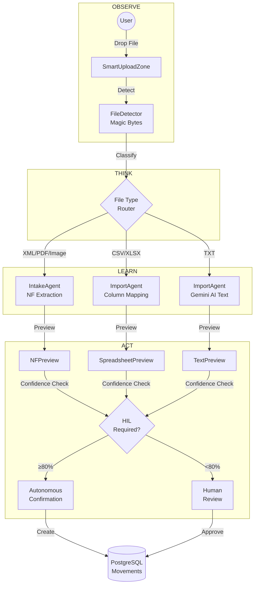

### Type Detection by Magic Bytes

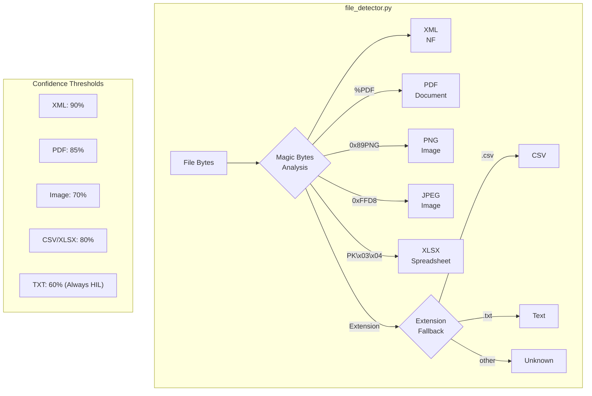

### Supported Formats

| Format | Magic Bytes | Agent | Base Confidence | Auto-Confirm |
|---------|------------|-------|----------------|--------------|
| **XML** | `<?xml` | IntakeAgent | 95% | ✅ Yes |
| **PDF** | `%PDF` | IntakeAgent | 85% | ✅ Yes |
| **JPG** | `0xFFD8` | IntakeAgent (Vision) | 70% | ⚠️ If >80% |
| **PNG** | `0x89PNG` | IntakeAgent (Vision) | 70% | ⚠️ If >80% |
| **CSV** | Extension | ImportAgent | 90% | ✅ If match >80% |
| **XLSX** | `PK\x03\x04` | ImportAgent | 90% | ✅ If match >80% |
| **TXT** | Extension | ImportAgent + Gemini | 60% | ❌ **Always HIL** |

---

## 10. NEXO Smart Import

**NEXO Smart Import** is the next-generation AI-powered import system that combines intelligent file processing with continuous learning capabilities.

### Key Features

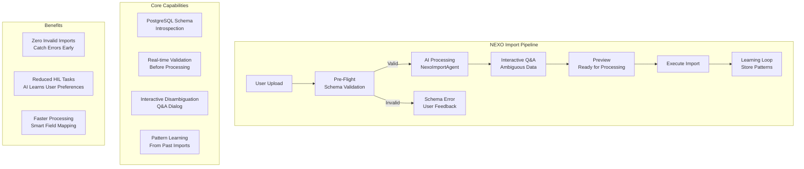

### Pre-Flight Validation Flow

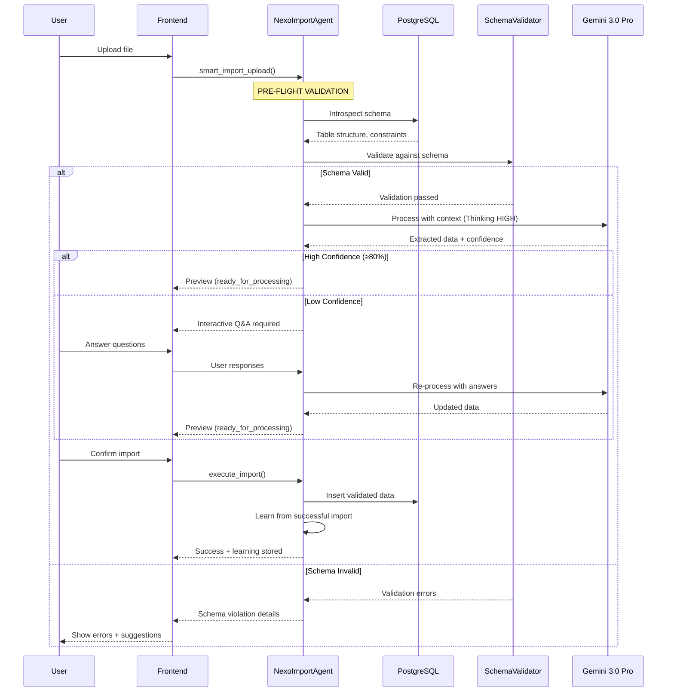

### Learning Patterns

The NEXO Import Agent continuously improves by:

1. **Field Mapping Memory**: Remembers successful column → database field mappings
2. **Data Pattern Recognition**: Learns common data formats (dates, part numbers, locations)
3. **User Preference Learning**: Adapts to how specific users prefer to resolve ambiguities
4. **Error Prevention**: Stores past validation errors to prevent recurrence

---

## 11. NF Entry Flow

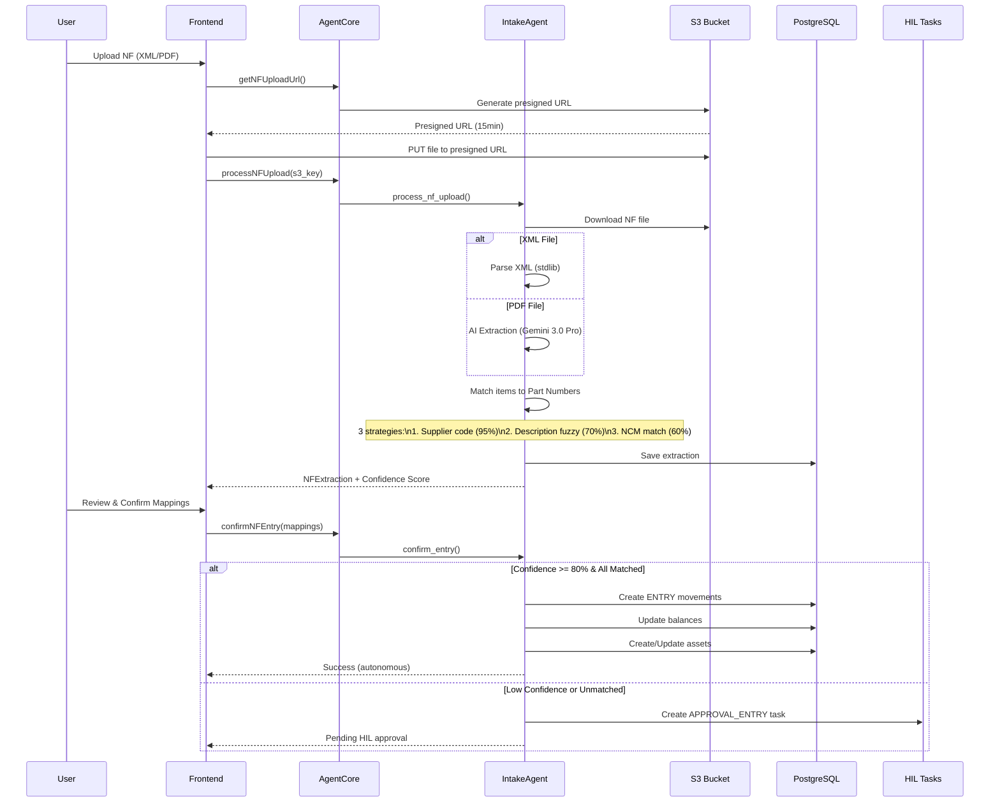

---

## 12. Reservation and Expedition Flow

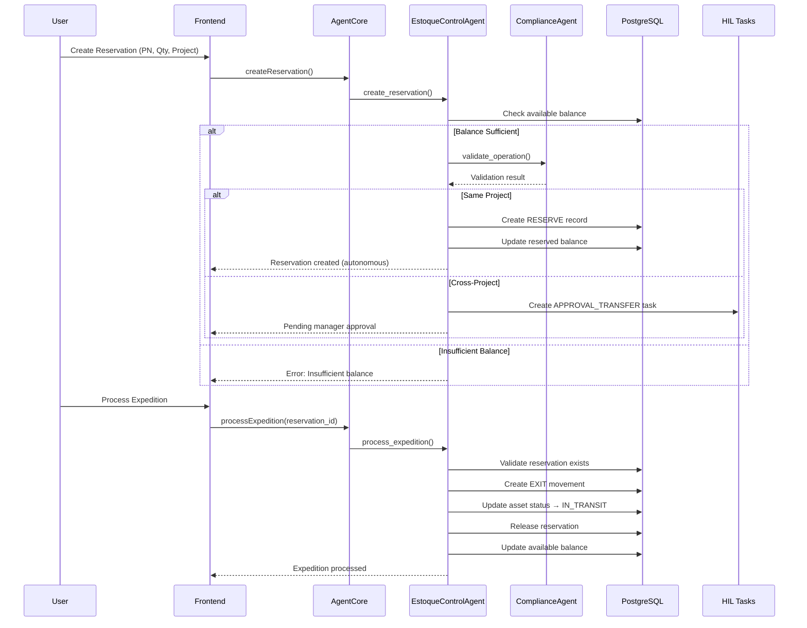

---

## 13. Inventory Counting Flow


---

## 14. HIL Workflow (Human-in-the-Loop)

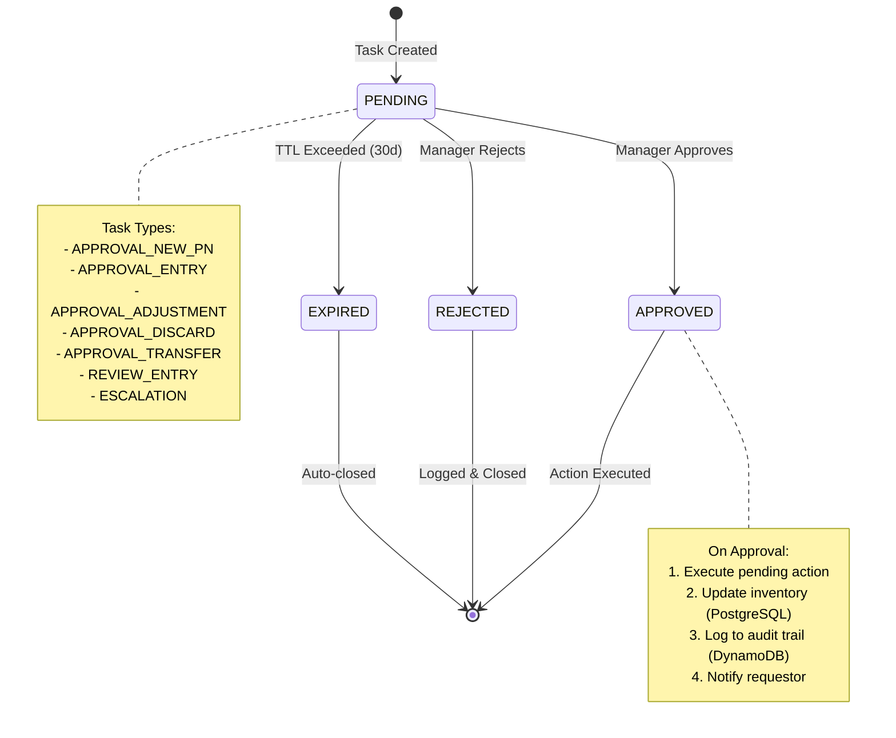

### HIL Decision Matrix

| Operation | Condition | Decision |
|----------|----------|---------|
| Same-project reservation | - | ✅ Autonomous |
| Cross-project reservation | - | 🔒 HIL Required |
| Normal transfer | - | ✅ Autonomous |
| Transfer to VAULT/QUARANTINE | - | 🔒 HIL Required |
| NF Entry | Confidence ≥ 80% | ✅ Autonomous |
| NF Entry | Confidence < 80% | 🔒 HIL Required |
| NF Entry | Unmapped items | 🔒 HIL Required |
| Inventory adjustment | Any | 🔒 **ALWAYS** HIL |
| Discard/Loss | Any | 🔒 **ALWAYS** HIL |
| New Part Number | Any | 🔒 HIL Required |

---

## 15. S3 Documents Structure

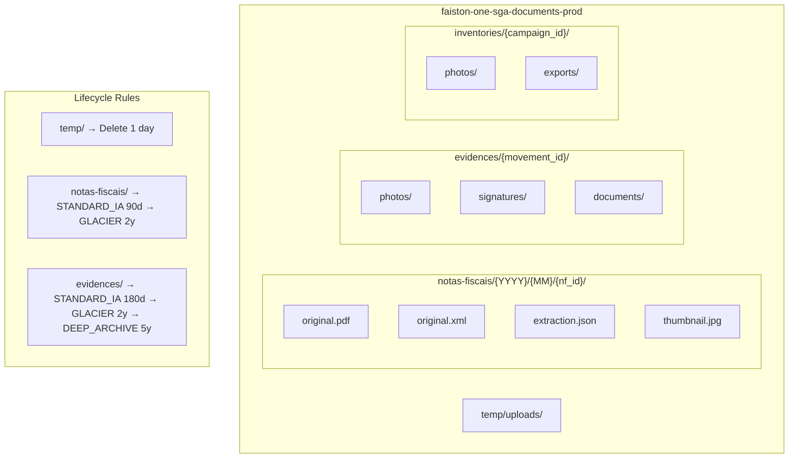

---

## 16. Key Frontend Components

### NEXO AI Components

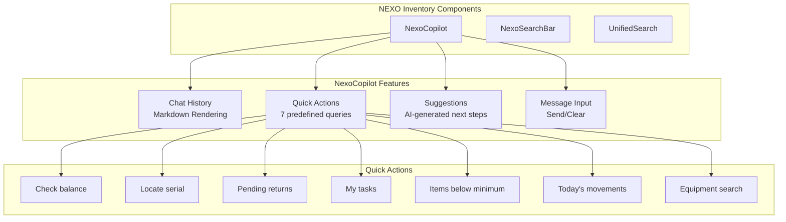

### Mobile/PWA Components

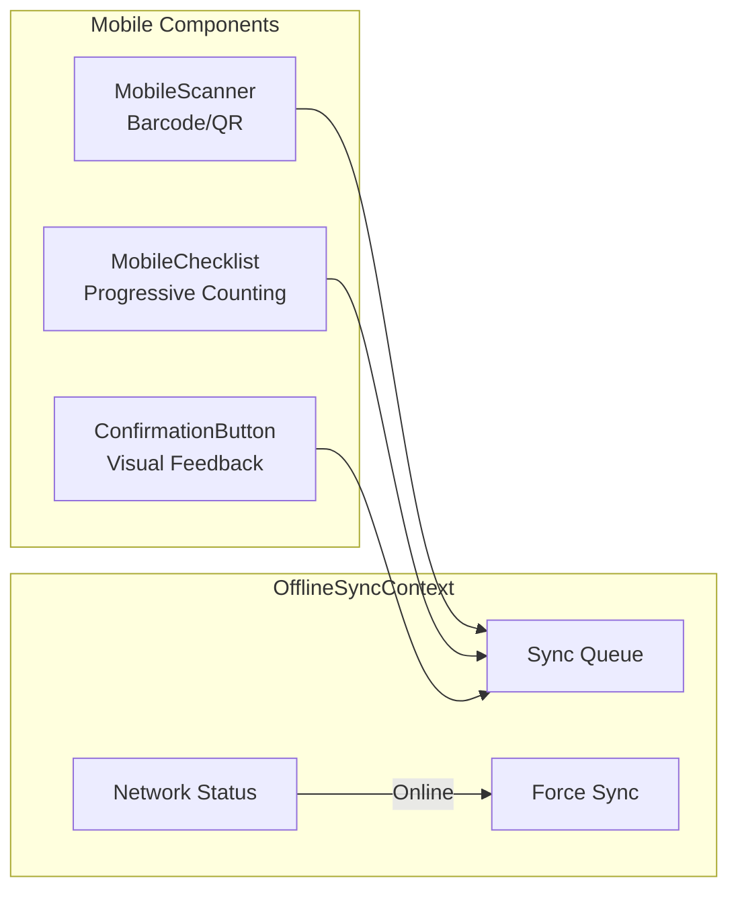

---

## 17. AWS Infrastructure Summary

| Resource | Name | Purpose |
|---------|------|-----------|
| **Aurora PostgreSQL** | `faiston-one-sga-postgres-prod` | Primary inventory datastore |
| **RDS Proxy** | `faiston-one-sga-proxy-prod` | Connection pooling for Lambda |
| **DynamoDB** | `faiston-one-sga-hil-tasks-prod` | Approval tasks (4 GSIs) |
| **DynamoDB** | `faiston-one-sga-audit-log-prod` | Immutable audit trail (4 GSIs) |
| **DynamoDB** | `faiston-one-sga-sessions-prod` | AgentCore session memory |
| **S3** | `faiston-one-sga-documents-prod` | NF, evidence, photos |
| **IAM Role** | `faiston-one-sga-agentcore-role` | AgentCore execution |
| **CloudFront** | `faiston-one-cdn` | CDN with URL Rewriter |
| **Cognito** | Shared pool | JWT authentication |

### Region and Account

- **AWS Account**: `377311924364`
- **Region**: `us-east-2` (Ohio)
- **Terraform State**: S3 + DynamoDB locking

---

## 18. Related Documentation

### Architecture
- [Agent Catalog](../AGENT_CATALOG.md) - Complete agent inventory
- [NEXO Memory Architecture](./NEXO_MEMORY_ARCHITECTURE.md) - Memory system design
- [Database Schema](../DATABASE_SCHEMA.md) - PostgreSQL and DynamoDB schemas
- [ADR-001: GLOBAL Namespace Design](./ADR-001-global-namespace.md)
- [ADR-002: Self-Managed Strategy Pattern](./ADR-002-self-managed-strategy.md)
- [ADR-003: Gemini 3.0 Model Selection](./ADR-003-gemini-model-selection.md)

### Implementation
- [AgentCore Implementation Guide](../AgentCore/IMPLEMENTATION_GUIDE.md)
- [Infrastructure](../INFRASTRUCTURE.md)
- [Troubleshooting](../TROUBLESHOOTING.md)

### Frontend
- **Routes**: `client/app/(main)/ferramentas/ativos/estoque/`
- **Components**: `client/components/ferramentas/ativos/estoque/`
- **Contexts**: `client/contexts/ativos/`
- **Hooks**: `client/hooks/ativos/`
- **Services**: `client/services/sgaAgentcore.ts`
- **Types**: `client/lib/ativos/types.ts`

### Backend
- **Main**: `server/agentcore-inventory/main.py`
- **Agents**: `server/agentcore-inventory/dist/{agent_name}/`
- **Tools**: `server/agentcore-inventory/tools/`
  - `file_detector.py` - Magic bytes file type detection

### Smart Import
- **Types**: `client/lib/ativos/smartImportTypes.ts`
- **Hook**: `client/hooks/ativos/useSmartImporter.ts`
- **Components**:
  - `SmartUploadZone.tsx` - Universal drag-and-drop
  - `SmartPreview.tsx` - Preview router
  - `previews/NFPreview.tsx` - NF preview
  - `previews/SpreadsheetPreview.tsx` - CSV/XLSX preview
  - `previews/TextPreview.tsx` - AI text preview

### Infrastructure
- **DynamoDB**: `terraform/main/dynamodb_sga_*.tf`
- **S3**: `terraform/main/s3_sga_documents.tf`
- **IAM**: `terraform/main/iam_sga_agentcore.tf`
- **CloudFront**: `terraform/main/cloudfront.tf`
- **RDS**: `terraform/main/rds_aurora_postgres.tf`

---

**Platform**: Faiston NEXO
**Last Updated**: January 2026
**Version**: 3.0 - Architecture corrected to reflect actual implementation
**Total Agents**: 14 (estoque_control, nexo_import, intake, import, learning, schema_evolution, validation, compliance, reconciliacao, observation, equipment_research, carrier, expedition, reverse)
**Framework**: AWS Strands Agents Framework + Google ADK v1.0
**Models**: Gemini 3.0 Pro (6 agents with Thinking) + Gemini 3.0 Flash (8 agents)
**Primary Datastore**: Aurora PostgreSQL (inventory data)
**Secondary Datastore**: DynamoDB (HIL tasks, audit logs, sessions)
**Communication**: A2A Protocol (JSON-RPC 2.0) on Port 9000
**Memory**: AgentCore Memory (Session + STM + LTM + RAG)
