# SGA Inventory Module Architecture - Faiston NEXO

## Overview

The **SGA Inventory** module (Asset Management System - Inventory) is a complete inventory management system with AI capabilities, human-in-the-loop (HIL) approval workflows, and offline/PWA support.

---

## 1. High-Level Architecture


---

## 2. Frontend Route Structure


---

## 3. Context Provider Hierarchy


---

## 4. Backend Agent Architecture (Google ADK)


---

## 5. DynamoDB Data Model (Single-Table Design)

```mermaid
erDiagram
    INVENTORY_TABLE {
        string PK "ENTITY#id"
        string SK "METADATA | context#key"
        string GSI1PK "SERIAL#serial_number"
        string GSI2PK "LOC#location_id"
        string GSI3PK "PROJ#project_id"
        string GSI4PK "STATUS#status"
        string GSI5PK "DATE#YYYY-MM"
        string GSI6PK "TIMELINE#asset_id"
        number ttl "TTL for reservations"
    }

    HIL_TASKS_TABLE {
        string PK "TASK#task_id"
        string SK "METADATA | COMMENT#ts"
        string GSI1PK "ASSIGNEE#user_id"
        string GSI2PK "STATUS#status"
        string GSI3PK "TYPE#task_type"
        string GSI4PK "REF#entity#id"
        number ttl "90d approved, 30d expired"
    }

    AUDIT_LOG_TABLE {
        string PK "LOG#YYYY-MM-DD"
        string SK "timestamp#event_id"
        string GSI1PK "ACTOR#type#id"
        string GSI2PK "ENTITY#type#id"
        string GSI3PK "TYPE#event_type"
        string GSI4PK "SESSION#session_id"
    }

    INVENTORY_TABLE ||--o{ HIL_TASKS_TABLE : "creates tasks"
    INVENTORY_TABLE ||--o{ AUDIT_LOG_TABLE : "logs events"
    HIL_TASKS_TABLE ||--o{ AUDIT_LOG_TABLE : "logs decisions"
```

### Entity Prefixes (PK Pattern)

| Prefix | Entity | Example PK |
|---------|----------|------------|
| `PN#` | Part Number | `PN#pn_001` |
| `ASSET#` | Serialized Asset | `ASSET#asset_123` |
| `LOC#` | Location | `LOC#loc_warehouse_01` |
| `BALANCE#` | Projected Balance | `BALANCE#pn_001#loc_01` |
| `MOVE#` | Movement (Immutable) | `MOVE#move_456` |
| `RESERVE#` | Reservation (TTL) | `RESERVE#res_789` |
| `TASK#` | HIL Task | `TASK#task_abc` |
| `DIV#` | Divergence | `DIV#div_xyz` |
| `DOC#` | Document | `DOC#nf_12345` |
| `PROJ#` | Project | `PROJ#proj_cliente_01` |

---

## 6. Smart Universal File Importer

The **Smart Import** is an intelligent importer that accepts ANY file format and automatically detects the type, routing to the appropriate agent.

### Philosophy: Observe → Think → Learn → Act

```mermaid
flowchart TB
    subgraph "OBSERVE"
        U((User)) -->|Drop File| UZ[SmartUploadZone]
        UZ -->|Detect| FD[FileDetector\nMagic Bytes]
    end

    subgraph "THINK"
        FD -->|Classify| Router{File Type\nRouter}
    end

    subgraph "LEARN"
        Router -->|XML/PDF/Image| IA[IntakeAgent\nNF Extraction]
        Router -->|CSV/XLSX| IMP[ImportAgent\nColumn Mapping]
        Router -->|TXT| TXT[ImportAgent\nGemini AI Text]
    end

    subgraph "ACT"
        IA -->|Preview| NFP[NFPreview]
        IMP -->|Preview| SSP[SpreadsheetPreview]
        TXT -->|Preview| TXP[TextPreview]

        NFP & SSP & TXP -->|Confidence Check| HIL{HIL\nRequired?}
        HIL -->|≥80%| AUTO[Autonomous\nConfirmation]
        HIL -->|<80%| REVIEW[Human\nReview]
    end

    AUTO -->|Create| MOV[(Movements)]
    REVIEW -->|Approve| MOV
```



### Tab Redesign (4 → 2)

```mermaid
flowchart LR
    subgraph "BEFORE (4 Tabs)"
        T1[NF\nXML/PDF]
        T2[Photo\nJPG/PNG]
        T3[SAP\nCSV/XLSX]
        T4[Manual]
    end

    subgraph "AFTER (2 Tabs)"
        ST[📁 Smart Upload\nALL formats]
        MT[✏️ Manual\nNo file]
    end

    T1 & T2 & T3 -.->|Consolidated| ST
    T4 -.->|Unchanged| MT
```



### Type Detection by Magic Bytes


### Smart Import Sequence


### Frontend Smart Import Architecture


### Supported Formats

| Format | Magic Bytes | Agent | Base Confidence | Auto-Confirm |
|---------|------------|-------|----------------|--------------|
| **XML** | `<?xml` | IntakeAgent | 95% | ✅ Yes |
| **PDF** | `%PDF` | IntakeAgent | 85% | ✅ Yes |
| **JPG** | `0xFFD8` | IntakeAgent (Vision) | 70% | ⚠️ If >80% |
| **PNG** | `0x89PNG` | IntakeAgent (Vision) | 70% | ⚠️ If >80% |
| **CSV** | Extension | ImportAgent | 90% | ✅ If match >80% |
| **XLSX** | `PK\x03\x04` | ImportAgent | 90% | ✅ If match >80% |
| **TXT** | Extension | ImportAgent + Gemini | 60% | ❌ **Always HIL** |

---

## 6.1. NEXO Smart Import

**NEXO Smart Import** is the next-generation AI-powered import system that combines intelligent file processing with continuous learning capabilities.

### Key Features


### Pre-Flight Validation Flow


### NEXO Import Agent Actions

| Action | Purpose | HIL Decision |
|--------|---------|--------------|
| `validate_schema` | Pre-flight check against PostgreSQL schema | None - Auto |
| `interactive_qa` | Ask user to disambiguate low-confidence fields | Optional |
| `smart_import_upload` | Process file with learning context | If <80% confidence |
| `learn_from_import` | Store successful patterns for future use | None - Auto |

### Learning Patterns

The NEXO Import Agent continuously improves by:

1. **Field Mapping Memory**: Remembers successful column → database field mappings
2. **Data Pattern Recognition**: Learns common data formats (dates, part numbers, locations)
3. **User Preference Learning**: Adapts to how specific users prefer to resolve ambiguities
4. **Error Prevention**: Stores past validation errors to prevent recurrence

---

## 7. NF Entry Flow (Legacy)


---

## 8. Reservation and Expedition Flow


---

## 9. Inventory Counting Flow


---

## 10. HIL Workflow (Human-in-the-Loop)


### HIL Decision Matrix

| Operation | Condition | Decision |
|----------|----------|---------|
| Same-project reservation | - | ✅ Autonomous |
| Cross-project reservation | - | 🔒 HIL Required |
| Normal transfer | - | ✅ Autonomous |
| Transfer to VAULT/QUARANTINE | - | 🔒 HIL Required |
| NF Entry | Confidence ≥ 80% | ✅ Autonomous |
| NF Entry | Confidence < 80% | 🔒 HIL Required |
| NF Entry | Unmapped items | 🔒 HIL Required |
| Inventory adjustment | Any | 🔒 **ALWAYS** HIL |
| Discard/Loss | Any | 🔒 **ALWAYS** HIL |
| New Part Number | Any | 🔒 HIL Required |

---

## 11. S3 Documents Structure


---

## 12. Key Frontend Components

### NEXO AI Components


### Mobile/PWA Components


---

## 13. AWS Infrastructure Summary

| Resource | Name | Purpose |
|---------|------|-----------|
| **DynamoDB** | `faiston-one-sga-inventory-prod` | Main table (6 GSIs, Streams) |
| **DynamoDB** | `faiston-one-sga-hil-tasks-prod` | Approval tasks (4 GSIs) |
| **DynamoDB** | `faiston-one-sga-audit-log-prod` | Immutable audit trail (4 GSIs) |
| **S3** | `faiston-one-sga-documents-prod` | NF, evidence, photos |
| **IAM Role** | `faiston-one-sga-agentcore-role` | AgentCore execution |
| **CloudFront** | `faiston-one-cdn` | CDN with URL Rewriter |
| **Cognito** | Shared pool | JWT authentication |

### Region and Account

- **AWS Account**: `377311924364`
- **Region**: `us-east-2` (Ohio)
- **Terraform State**: S3 + DynamoDB locking

---

## Related Files

### Frontend
- **Routes**: `client/app/(main)/ferramentas/ativos/estoque/`
- **Components**: `client/components/ferramentas/ativos/estoque/`
- **Contexts**: `client/contexts/ativos/`
- **Hooks**: `client/hooks/ativos/`
- **Services**: `client/services/sgaAgentcore.ts`
- **Types**: `client/lib/ativos/types.ts`

### Backend
- **Main**: `server/agentcore-inventory/main.py`
- **Agents**: `server/agentcore-inventory/agents/`
- **Tools**: `server/agentcore-inventory/tools/`
  - `file_detector.py` - Magic bytes file type detection

### Smart Import (NEW)
- **Types**: `client/lib/ativos/smartImportTypes.ts`
- **Hook**: `client/hooks/ativos/useSmartImporter.ts`
- **Components**:
  - `SmartUploadZone.tsx` - Universal drag-and-drop
  - `SmartPreview.tsx` - Preview router
  - `previews/NFPreview.tsx` - NF preview
  - `previews/SpreadsheetPreview.tsx` - CSV/XLSX preview
  - `previews/TextPreview.tsx` - AI text preview

### Infrastructure
- **DynamoDB**: `terraform/main/dynamodb_sga_*.tf`
- **S3**: `terraform/main/s3_sga_documents.tf`
- **IAM**: `terraform/main/iam_sga_agentcore.tf`
- **CloudFront**: `terraform/main/cloudfront.tf`

---

**Platform**: Faiston NEXO
**Last Updated**: January 2026
**Version**: 2.0 - Full English translation, updated agent count (14), NEXO Smart Import added
